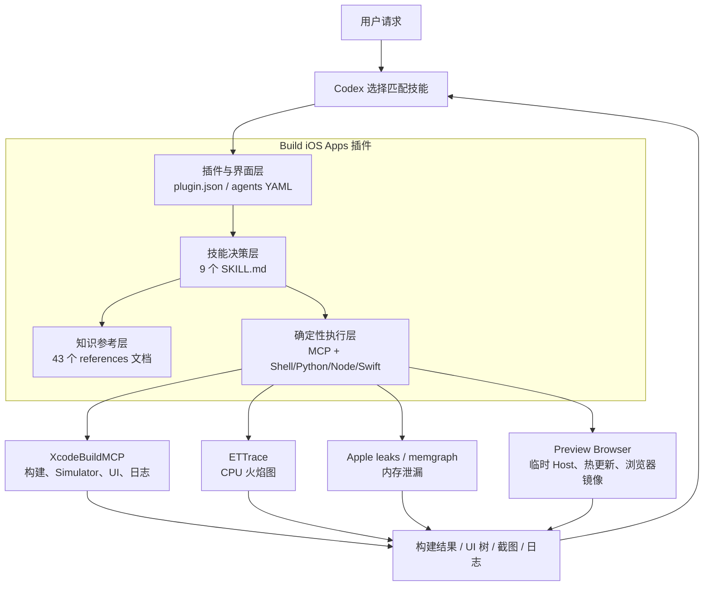
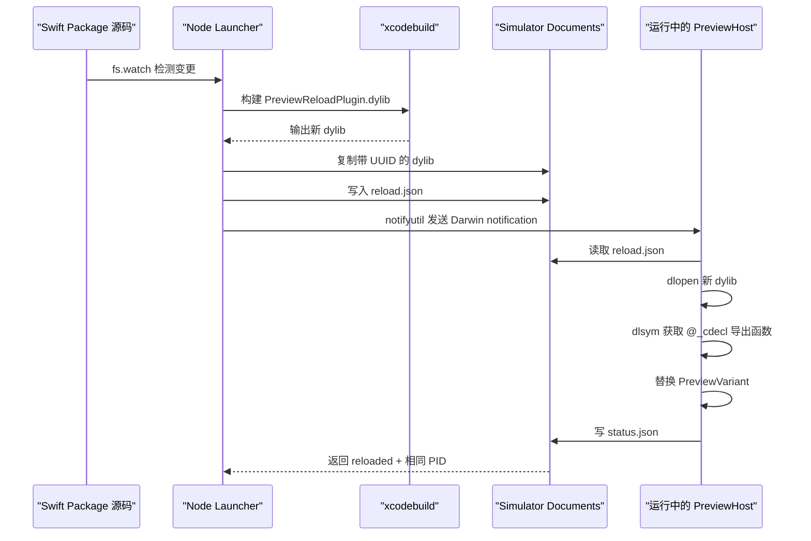

# Build iOS Apps 插件分析

> 分析对象：`build-ios-apps@openai-curated-remote`<br>
> 本机版本：`0.1.2`<br>
> 本机安装路径：`/Users/mac/.codex/plugins/cache/openai-curated-remote/build-ios-apps/0.1.2`<br>
> 首次分析：2026-07-19<br>
> 用户能力结论更新：2026-07-20

## 先看最核心的结论

### 从用户感知来说，它到底能做什么

安装 `Build iOS Apps` 后，你能够直接感知到的不是“多了 9 份技能文档”，而是 Codex 可以把一条 iOS 开发需求连续执行下去：

| 你可以直接提出的需求 | 它能否完成 | 用户最终能看到什么 |
|---|---|---|
| “给我写一个 SwiftUI 页面/功能” | **能** | 工程里的 Swift 代码被直接创建或修改 |
| “把项目构建起来” | **能** | 真实的 Xcode build 结果，而不是只生成代码 |
| “启动 App 给我看” | **能，主要面向 Simulator** | App 被安装并启动在指定 iOS Simulator |
| “让我在浏览器里看到它” | **能** | Codex 内置浏览器中出现 Simulator 的实时镜像 |
| “帮我点按钮、输入文字、走一遍流程” | **能** | Agent 根据 UI 结构操作 Simulator，并用截图或 UI 状态验证 |
| “我改完代码后马上看 Preview” | **能，但有条件** | Swift Package 中的 SwiftUI Preview 可在 Simulator 中展示和热更新 |
| “为什么这里很卡” | **能诊断** | 代码审查、ETTrace 火焰图、CPU 热点和前后对照 |
| “这里是不是内存泄漏” | **能诊断** | `.memgraph`、泄漏类型、引用路径和修复前后证据 |
| “接入 Siri、Shortcuts、Spotlight” | **能开发和验证** | App Intents、Entity、Query、Shortcut 等代码 |
| “做成 iOS 26 Liquid Glass” | **能开发和审查** | 原生 Liquid Glass 实现及旧系统回退 |
| “直接发布到 TestFlight / App Store” | **不能，仅靠这个插件做不到** | 插件没有上传、签名和 App Store Connect 提交流程 |

所以，最准确的用户价值是：

> 它让 Codex 不只会“写 iOS 代码”，还可以把代码真正构建起来、启动到 Simulator、在浏览器中展示、自动交互，并用运行证据继续修复问题。

### 你最容易感知到的完整闭环


这也是你会觉得它“能够直接构建代码，并且启动对应浏览器”的原因：

1. **写代码**依赖 Codex 本身的文件读写能力，插件补充 iOS/SwiftUI 工程规则；
2. **真实构建和启动**依赖插件接入的 XcodeBuildMCP；
3. **浏览器展示**依赖 `serve-sim` 把指定 Simulator 的画面变成一个本地网页流；
4. **交互和验证**依赖 XcodeBuildMCP 的 UI automation、截图和日志能力。

这里的“启动浏览器”不是把 iOS App 编译成 Web App，也不是在 Safari 里运行 SwiftUI。它实际上是：

```text
iOS App 仍然运行在 Simulator
→ serve-sim 读取 Simulator 画面并提供本地页面
→ Codex 内置浏览器打开这个页面
→ 你在浏览器里看到真实 Simulator
```

### 它到底能不能直接上架 App Store

**结论：不能。当前 `0.1.2` 版本的插件本身不包含完整的 App Store 上架能力。**

插件接入的 XcodeBuildMCP 只开启了：可以可以可以可以可以

```text
simulator
ui-automation
debugging
logging
```

插件中没有发现以下发布链路：

| 真正上架所需步骤 | 插件是否具备 |
|---|---|
| 管理 Apple Developer Team 和证书 | **没有** |
| 管理 Provisioning Profile | **没有** |
| 针对 Generic iOS Device 做产品 Archive | **没有对应工作流** |
| `exportArchive` 生成签名 IPA | **没有** |
| 登录 App Store Connect | **没有** |
| 上传 TestFlight build | **没有** |
| 管理版本号、构建号和商店元数据 | **没有专门能力** |
| 提交 App Review | **没有** |
| 跟踪审核状态和处理驳回 | **没有** |

因此，这个插件能把 App 推进到“代码完成、Simulator 可以运行、核心问题经过验证”的阶段，但不能独立完成：

```text
签名 → Archive → 导出 IPA → 上传 TestFlight
→ 填写 App Store Connect 信息 → 提交审核 → 正式发布
```

### 为什么它看起来好像支持“上架”

这里有三个容易混淆的地方。

#### 1. “Build iOS Apps” 中的 Build 不等于发布

这里的 Build 主要是：

- 编译 Swift/SwiftUI 代码；
- 构建 Simulator App；
- 安装并启动；
- 验证运行结果。

它不是 App Store 意义上的 distribution 和 release。

#### 2. 插件代码里出现 `xcodebuild archive`，但不是在打包用户 App

ETTrace 技能确实调用了 `xcodebuild archive`，但它的目标是临时构建：

```text
ETTrace.framework / ETTrace.xcframework
```

这是给 Simulator 性能采样使用的依赖，不是把用户的 App Archive 后上传 App Store。

#### 3. Codex 可能仍然“帮你执行上架命令”，但来源不是这个插件

如果用户工程已经具备：

- 正确的签名和 Team 配置；
- Fastlane 或 CI 发布脚本；
- App Store Connect API Key；
- 可用的 Archive / Upload 命令；

那么 Codex 作为通用开发 Agent，理论上可以在用户授权后运行这些现成脚本。但这时真正提供上架能力的是：

```text
Codex 的终端执行能力
+ 用户工程自己的发布脚本
+ Apple 账号、证书和 App Store Connect 配置
```

而不是 `Build iOS Apps` 插件自身。

### 一句话重新定位

`Build iOS Apps` 的意义不是“替代 Xcode 并自动上架”，而是给 Codex 增加一套 **iOS 工程知识 + Xcode/Simulator 执行工具 + 浏览器可视化 + 性能和内存取证能力**。

更通俗地说：

> 普通 Codex 像一个懂 Swift 的程序员；安装这个插件后，它又拿到了一套 Simulator 遥控器、浏览器监视器和性能诊断设备，但还没有拿到你的 Apple 开发者账号和 App Store 发布后台。

---

## 1. 这个插件解决了什么问题

通用大模型可以生成 Swift/SwiftUI 代码，但真实 iOS 开发不只是“把代码写出来”，还包含：

- 如何选择正确的 SwiftUI 状态管理方式；
- 如何组织导航、Sheet、Tab、异步状态和依赖；
- 如何在 Xcode 中构建并运行到指定 Simulator；
- 如何观察当前 UI，而不是凭代码猜运行结果；
- 如何采集日志、截图、CPU profile 和 memgraph；
- 如何证明性能问题或内存泄漏真的被修复；
- 如何适配 App Intents、Siri、Shortcuts、Spotlight 和 iOS 26 Liquid Glass；
- 如何在不污染用户工程的情况下展示 SwiftUI Preview。

这个插件把上述问题拆成 9 个专门技能，再为其中需要真实执行的环节接入 MCP 工具和本地脚本。

它的核心价值可以概括为四点：

1. **把隐性的 iOS 经验变成显式流程**
   例如先明确状态归属，再选择 `@State`、`@Binding`、`@Observable` 或 Environment，而不是随手创建 ViewModel。

2. **把“生成代码”扩展成“生成—构建—运行—观察—修复—复验”**
   XcodeBuildMCP 负责连接 Xcode 与 Simulator，让 Codex 可以检查真实构建结果、UI、日志和截图。

3. **把性能判断从猜测升级为证据**
   ETTrace 和 memgraph 工作流要求保留符号、采集文件、调用栈和前后对照，避免只凭代码表象宣布“已优化”。

4. **把插件设计成可组合能力，而不是一个大而全 Agent**
   写 UI、重构 View、查卡顿、查泄漏、调试 Simulator 分别由不同技能处理，复杂任务可以串联多个技能。

---

## 2. 它不是什么

为了准确理解这个插件，需要先排除几个误解：

- 它不是 Xcode 的替代品，底层仍然调用 `xcodebuild`、`xcrun simctl`、Apple `leaks` 等工具。
- 它不是“输入一句话就发布 App Store”的无代码平台。
- 它没有自带完整的项目脚手架生成器，也没有覆盖证书、Provisioning Profile、TestFlight 和 App Store Connect 发布。
- 它没有自带 iOS Simulator Runtime；本机仍需安装 Xcode 和可用的 Simulator Runtime。
- 它的大部分能力是 **技能说明和参考知识**，不是所有技能都有独立程序。
- 它不是一个始终运行的后台服务；对应技能被触发时，Codex 才会读取说明并调用工具。

---

## 3. 插件整体构成

### 3.1 本机包体统计

| 项目 | 数量 / 大小 |
|---|---:|
| 插件版本 | `0.1.2` |
| 总文件数 | 76 |
| 技能数 | 9 |
| Markdown 技能与参考文档 | 52 |
| 其中参考文档 | 43 |
| 可执行脚本与 Swift 模板 | 9 |
| 包体大小 | 约 440 KB |

### 3.2 目录结构

```text
build-ios-apps/0.1.2/
├── .codex-plugin/
│   └── plugin.json                 # 插件注册清单
├── .mcp.json                       # XcodeBuildMCP 接入配置
├── agents/
│   └── openai.yaml                 # 插件在 Codex 中的名称、图标、默认提示
├── assets/
│   ├── app-icon.png
│   └── build-ios-apps-small.svg
├── README.md
└── skills/
    ├── ios-app-intents/
    ├── ios-debugger-agent/
    ├── ios-ettrace-performance/
    ├── ios-memgraph-leaks/
    ├── ios-simulator-browser/
    ├── swiftui-liquid-glass/
    ├── swiftui-performance-audit/
    ├── swiftui-ui-patterns/
    └── swiftui-view-refactor/
```

每个技能目录采用同一种约定：

```text
skill-name/
├── SKILL.md                 # 何时触发、工作步骤、原则与边界
├── agents/openai.yaml       # 技能在界面中的名称和默认提示
├── references/              # 按需读取的知识库与代码范式
└── scripts/                 # 只有需要确定性执行时才提供
```

并不是每个技能都包含 `references/` 或 `scripts/`。这反映了插件的一个重要设计原则：

> 能靠工程规则和现有工具完成的事情，用技能指导；需要稳定、可重复、可验证处理的事情，再落成脚本。

---

## 4. 四层架构



### 4.1 插件注册层

`.codex-plugin/plugin.json` 告诉 Codex：

- 插件名为 `build-ios-apps`；
- 版本为 `0.1.2`；
- 技能目录位于 `./skills/`；
- MCP 配置位于 `./.mcp.json`；
- 插件具备 `Interactive`、`Read`、`Write` 能力；
- 插件的展示名称、描述、图标、默认 Prompt 和品牌色。

这一层本身不执行 iOS 操作，作用是让 Codex 识别和加载插件。

### 4.2 技能决策层

每个 `SKILL.md` 由三部分构成：

1. YAML front matter 中的名称与触发描述；
2. 标准工作流程；
3. 强约束、反模式、验证方式和输出要求。

它本质上是给 Agent 的“操作规程”。例如：

- `ios-debugger-agent` 规定先找 Booted Simulator，再设置工程、Scheme 和设备默认值；
- `ios-memgraph-leaks` 规定不能仅凭 memgraph 变小就宣称泄漏修复；
- `swiftui-view-refactor` 规定优先 MV，而不是无条件引入 MVVM；
- `ios-ettrace-performance` 规定不能分析未符号化的 flamegraph。

### 4.3 参考知识层

参考库不是一次性全部塞进上下文，而是由技能根据任务按需读取。这样既降低上下文噪声，也允许每个主题保持足够细。

参考内容主要包括：

- App Intents 的实体、查询、快捷指令、系统入口和代码模板；
- SwiftUI 导航、Sheet、Tab、列表、表单、搜索、异步状态、主题、预览、性能等 30 个组件主题；
- Liquid Glass API 和回退策略；
- SwiftUI 性能 code smells、Instruments 采集说明和报告模板；
- MV 架构和大 View 重构模式。

### 4.4 执行与证据层

这一层负责真正改变或读取系统状态：

- XcodeBuildMCP：构建、启动、UI 自动化、日志和截图；
- Node.js：创建临时 Preview Host，调用 `xcodebuild` 和监听文件变更；
- Swift 模板：运行预览 Host，通过 `dlopen` 加载热更新 dylib；
- Shell：采集 dSYM、memgraph；
- Python：严格解析 ETTrace JSON 和 Apple `leaks` 输出；
- `serve-sim`：把 Simulator 画面镜像到 Codex 内置浏览器。

---

## 5. 九个技能分别做什么

| 技能 | 解决的问题 | 实现方式 | 典型产出 |
|---|---|---|---|
| `ios-app-intents` | 把 App 能力开放给 Shortcuts、Siri、Spotlight、Widget、Control | 技能规则 + 4 份参考文档与代码模板 | `AppIntent`、`AppEntity`、`EntityQuery`、`AppShortcutsProvider` |
| `ios-debugger-agent` | 构建、启动和调试 Simulator 中的 App | 调用 XcodeBuildMCP | 构建结果、UI 树、交互结果、日志、截图 |
| `ios-ettrace-performance` | 定位启动或运行流程中的 CPU 热点 | ETTrace + dSYM 收集脚本 + JSON 分析器 | 已符号化火焰图、热点栈、占比、前后对照 |
| `ios-memgraph-leaks` | 查找对象泄漏、引用环和内存增长原因 | `simctl` + Apple `leaks` + Shell/Python 脚本 | `.memgraph`、类型统计、`traceTree`、泄漏报告 |
| `ios-simulator-browser` | 在 Codex 浏览器中看 Simulator，展示 SwiftUI Preview 并热更新 | `serve-sim` + Node launcher + 临时 Xcode Host + dylib 注入 | 浏览器可见 Simulator、Preview 翻页、同进程热更新证据 |
| `swiftui-liquid-glass` | 实现或审查 iOS 26+ Liquid Glass | 技能规则 + API 参考 | `glassEffect`、`GlassEffectContainer`、可用性回退 |
| `swiftui-performance-audit` | 从代码优先排查 SwiftUI 卡顿、重绘和高 CPU | code smells + profiling intake + 报告模板 | 按影响排序的问题、修复建议、验证指标 |
| `swiftui-ui-patterns` | 构建导航、状态、布局、控件和页面组合 | 30 份组件参考与通用规则 | 符合现代 SwiftUI 数据流的页面实现 |
| `swiftui-view-refactor` | 拆分大型 View，收紧状态与依赖流 | MV-first 重构规则 + 参考模式 | 更小的 View 类型、稳定 View tree、清晰副作用边界 |

### 能力分组

可以把 9 个技能进一步归为四组：

| 分组 | 技能 |
|---|---|
| 产品能力接入 | `ios-app-intents` |
| UI 构建与架构 | `swiftui-ui-patterns`、`swiftui-view-refactor`、`swiftui-liquid-glass` |
| 运行与可视化 | `ios-debugger-agent`、`ios-simulator-browser` |
| 性能与稳定性 | `swiftui-performance-audit`、`ios-ettrace-performance`、`ios-memgraph-leaks` |

---

## 6. 具体是怎么实现的

### 6.1 XcodeBuildMCP：让 Codex 真正操作 Xcode 与 Simulator

插件通过 `.mcp.json` 注册一个 MCP Server：

```json
{
  "mcpServers": {
    "xcodebuildmcp": {
      "command": "npx",
      "args": ["-y", "xcodebuildmcp@latest", "mcp"],
      "env": {
        "XCODEBUILDMCP_ENABLED_WORKFLOWS": "simulator,ui-automation,debugging,logging"
      }
    }
  }
}
```

这意味着：

1. Codex 启用插件后，通过 `npx` 启动 `xcodebuildmcp@latest`；
2. MCP Server 把 Xcode 和 Simulator 操作包装成结构化工具；
3. 插件只打开四类工作流：
   - `simulator`
   - `ui-automation`
   - `debugging`
   - `logging`
4. `ios-debugger-agent` 再规定调用顺序和失败处理。

标准链路是：

```text
列出 Simulator
→ 选择 Booted 设备
→ 设置 project/workspace、scheme、simulatorId
→ build_run_sim
→ describe_ui 或 screenshot 验证启动
→ 按 UI label/id 交互
→ 采集日志
→ 总结运行证据
```

这里的关键不是“多了几个 shell 命令”，而是把设备、工程、Scheme、UI 元素和日志会话变成了 Agent 可可靠调用的结构化接口。

### 6.2 SwiftUI Preview Browser：生成临时 Host，并在同一进程热更新

这是插件中实现最复杂、也最有原创工程价值的一部分。

#### 初次启动流程

Node 脚本 `swiftui-preview-browser.mjs` 接收：

```bash
node swiftui-preview-browser.mjs \
  /absolute/path/to/Package.swift \
  --package-target "<target>" \
  --device "<simulator-udid>"
```

它会：

1. 用 `swift package dump-package` 和 `swift package describe --type json` 解析 Swift Package；
2. 验证用户指定的是 `regular` target；
3. 找到包含该 target 的可链接 library product；
4. 把包支持的 iOS 版本提高到至少 iOS 17，供临时 Host 使用 Observation；
5. 根据包路径、Module 和过滤条件计算哈希，创建稳定的临时目录；
6. 生成一个不在用户源码树中的 `PreviewHost.xcodeproj`；
7. 将本地 Swift Package 和固定 revision 的 `SnapshotPreviewsCore` 接入临时工程；
8. 构建、安装并启动 bundle id 为 `dev.swiftui-preview-browser.host` 的 Host；
9. 通过 Host 写出的 `status.json` 确认 Preview 已真实渲染。

临时工程包含两个 target：

- `PreviewHost.app`：长期运行的预览容器；
- `PreviewReloadPlugin.dylib`：每次源码变化时重新构建的动态库。

#### Preview 是怎么被发现的

`PreviewBrowserEntries.swift` 调用 `SnapshotPreviewsCore`：

```swift
FindPreviews.findPreviews(...)
```

它扫描选定 Module 中的 `PreviewProvider` 和 `#Preview` 注册信息，转成统一的 `PreviewVariant`：

- `id`
- 分组名
- 展示名
- `makeView() -> AnyView`

Host 用 `TabView(.page)` 展示全部 Preview，并提供上一个、下一个和当前页码控件。

#### 热更新流程



关键实现细节：

- Node 用 `fs.watch(..., { recursive: true })` 监听包目录；
- 250ms debounce 合并一次保存产生的多个文件事件；
- 并发修改时只允许一个 reload 运行，并排队一次后续 reload；
- 新 dylib 使用 UUID 文件名，避免覆盖已被加载的动态库；
- `reload.json` 传递 token 和 dylib 路径；
- `notifyutil` 发送 Darwin notification；
- Host 用 `dlopen` 加载新 dylib；
- dylib 用 `@_cdecl` 暴露 Preview 数量、名称和 `AnyView` 创建函数；
- Host 用 `dlsym` 获取 C ABI 函数地址；
- Node 检查热更新前后的 PID，PID 变化就判定热更新失败。

最后再用 `serve-sim@latest` 把同一个 Simulator UDID 镜像进 Codex 浏览器。

#### 为什么不修改用户工程

临时 Host 全部生成在系统临时目录中，技能明确禁止为了 Preview 去修改用户的：

- `.xcodeproj`
- `.xcworkspace`
- `Package.swift`
- Scheme
- Build Settings

这是很重要的安全边界：预览基础设施失败时，不会给真实项目留下难以清理的工程配置。

### 6.3 ETTrace：CPU 性能取证

ETTrace 工作流不是简单执行一次 profiler，而是建立一个“可解释结果”的门禁。

#### 采集流程

```text
选定一个明确的用户流程
→ 构建最终要测试的 Simulator App
→ 临时链接 ETTrace.xcframework
→ 收集与二进制 UUID 匹配的 dSYM
→ 运行一次 launch 或 runtime trace
→ 立即保存 output_<thread>.json
→ 严格解析 processed JSON
→ 输出热点与限制
```

#### `collect_ios_dsyms.sh`

脚本会：

- 读取 App 的 `CFBundleExecutable`；
- 用 `dwarfdump --uuid` 读取 App 和 Framework 二进制 UUID；
- 在构建目录、Bazel 输出和 DerivedData 中搜索 `.dSYM`；
- 只复制 UUID 完全匹配的 dSYM；
- App dSYM 缺失时直接失败；
- 可要求指定 Framework 或所有 Framework 都必须有匹配符号。

这解决了性能分析中很常见的问题：火焰图存在，但关键调用栈没有符号，最后只能看到地址或 `<unattributed>`。

#### `analyze_flamegraph_json.py`

分析器只接受 ETTrace v1.1.0 的 processed `output_<thread>.json`：

- 顶层必须有 `nodes`；
- 检测到 raw JSON 的 `threads` + `libraryInfo` 会拒绝；
- 检测到旧格式 `threadNodes` 会拒绝；
- 校验每个节点的 `children` 与数值型 `duration`；
- 区分 idle、unattributed 和 active；
- 计算 self weight 与 inclusive weight；
- 默认过滤 run loop、app entrypoint 等通用 wrapper；
- 支持按函数名 substring 聚焦输出。

这种“格式不对就失败”的设计很重要，因为它宁愿不输出结论，也不根据错误数据制造看似精确的热点排序。

### 6.4 Memgraph：内存泄漏取证

#### `capture_sim_memgraph.sh`

脚本执行：

1. 接收明确的 Simulator UDID 和 bundle id；
2. 在 Simulator 的 `launchctl list` 中寻找唯一运行 PID；
3. 如果没找到或找到多个 PID，直接失败；
4. 调用 Apple `leaks --outputGraph=<path> <pid>`；
5. 同时保存：
   - `.memgraph`
   - 原始 leaks 文本
   - UDID、bundle id、PID、时间和退出码等 metadata。

#### `summarize_memgraph_leaks.py`

脚本会：

- 调用 `leaks --list`；
- 解析泄漏数量、字节数、地址、类型、语言和 image；
- 按类型和 image 聚合；
- 可对前 N 个泄漏运行 `leaks --traceTree=<address>`；
- 对找不到 root 的自引用候选，补充 `leaks --groupByType`；
- 输出 Markdown 报告和复现命令。

技能层还要求：

- 先定义对象应有的生命周期；
- 找到第一个 App 自有的泄漏类型；
- 用 ownership path 或 grouped leak tree 证明 retaining edge；
- 修复后用相同流程、相同 Simulator 再采一次；
- 不能因为总泄漏数减少就宣称修复成功。

### 6.5 SwiftUI 构建、重构与审查技能

这部分主要通过知识与约束实现，而不是独立脚本。

#### `swiftui-ui-patterns`

这是插件最大的知识库，共 30 个主题参考，覆盖：

- App root wiring 与依赖图；
- async state、取消、debounce；
- NavigationStack、deep links、TabView、Sheet；
- List、ScrollView、Grid、Form、Search；
- focus、input toolbar、loading placeholder；
- overlays、top bar、title menu；
- media、matched transition、scroll reveal；
- theming、haptics、previews、performance；
- macOS settings、menu bar、split view。

它的核心立场是：

- 先决定状态的所有权，再选择 property wrapper；
- iOS 17+ 优先 `@Observable`；
- 共享 App Service 才放 Environment；
- feature-local 依赖优先显式注入；
- 使用 `.task` / `.task(id:)` 管理异步生命周期；
- Sheet 优先使用 item/enum 驱动；
- 保持稳定 identity，避免不必要重绘。

#### `swiftui-view-refactor`

它明确采用 **MV-first**：

- 小型本地状态直接留在 View；
- 共享依赖通过 Environment；
- 业务逻辑放 Service / Domain Model；
- 先拆 View，再考虑 ViewModel；
- 只有现有工程明确使用或需求确实需要时才引入 ViewModel。

它还规定：

- 文件中的属性、init、body 和 helper 顺序；
- 长 body 拆成明确的子 View 类型；
- 非平凡 action 和副作用移出 `body`；
- 避免根节点 `if/else` 整体换树；
- 超过约 300 行时积极拆分；
- 重构默认不得改变布局和业务行为。

#### `swiftui-performance-audit`

它先做 code-first review，再决定是否需要 Instruments 或 ETTrace：

- 观察范围过大造成 invalidation storm；
- `ForEach` identity 不稳定；
- `body` 中排序、过滤、formatter 或图片解码；
- `GeometryReader` / preference chain 引起 layout thrash；
- 主线程重活；
- 过宽的 animation / transition。

它要求在输出中区分：

- 代码层面的怀疑；
- Trace 已证实的问题；
- 仍缺少什么证据。

#### `swiftui-liquid-glass`

它封装的是 iOS 26+ 的 UI 采用规范：

- 优先原生 `glassEffect`，而不是自制 blur；
- 多个玻璃元素使用 `GlassEffectContainer`；
- 只有交互元素才加 `.interactive()`；
- `glassEffect` 放在布局和外观 modifier 之后；
- 用 `glassEffectID` 做 morphing；
- 必须用 `#available(iOS 26, *)` 提供旧系统回退。

### 6.6 App Intents：让 App 进入系统级入口

`ios-app-intents` 的设计重点不是复制 App 所有页面，而是找出 1–3 个真正适合在 App 外完成的动作。

它引导 Codex 依次完成：

1. 先定义用户动词，例如 open、find、compose、continue；
2. 只为系统需要理解的对象建立小型 `AppEntity`；
3. 决定操作是在系统界面内完成，还是通过 `openAppWhenRun` 进入 App；
4. 增加 `AppShortcutsProvider`；
5. 验证 intent target 能编译，运行后能路由到正确位置。

参考库提供的模板包括：

- open-app handoff intent；
- inline action intent；
- `AppEnum` 固定选项；
- `AppEntity` + `EntityQuery`；
- 参数依赖查询；
- Widget configuration intent；
- App Shortcuts provider；
- 文件输入。

---

## 7. 一个复杂任务中，多个技能如何组合

假设用户提出：

> “这个 SwiftUI 列表滑动很卡，帮我定位并修复，然后让我看到修复后的运行效果。”

插件的合理组合是：

```text
swiftui-performance-audit
→ 先从代码检查 identity、observation、body 中的重计算

ios-debugger-agent
→ 构建并运行到 Simulator，复现交互

ios-ettrace-performance
→ 对同一滑动流程采集已符号化 trace

swiftui-view-refactor / swiftui-ui-patterns
→ 实施最小范围修复

ios-debugger-agent
→ 重新构建、运行和交互

ios-ettrace-performance
→ 用同样流程做前后对照

ios-simulator-browser
→ 在 Codex 浏览器展示真实运行画面
```

这体现了插件最重要的架构思想：**技能负责判断与约束，工具负责行动，产物负责证明。**

---

## 8. 外部依赖与运行条件

| 依赖 | 用途 | 插件中的方式 |
|---|---|---|
| macOS | Xcode、Simulator、Apple `leaks` 的宿主 | 必需 |
| Xcode + iOS Simulator Runtime | 构建和运行 iOS App | 必需，但插件不负责提供 Runtime |
| Node.js / `npx` | 启动 XcodeBuildMCP、`serve-sim` 和 Preview launcher | 必需 |
| `xcodebuild` / `xcrun simctl` | 构建、安装、启动、设备控制 | 系统命令 |
| XcodeBuildMCP | 结构化 Simulator、UI、调试与日志操作 | `xcodebuildmcp@latest` |
| `serve-sim` | 将 Simulator 镜像到浏览器 | `serve-sim@latest` |
| Python 3 | ETTrace JSON 和 memgraph 文本解析 | 本地脚本 |
| Apple `leaks` | 采集和分析 `.memgraph` | 系统命令 |
| ETTrace runner | 采集 CPU trace | Homebrew 安装 |
| `ETTrace.xcframework` | App 侧插桩 | 临时链接进 Simulator build |
| SnapshotPreviewsCore | 扫描 SwiftUI Preview 注册信息 | 固定 Git revision |

### 本机当前环境核对

| 项目 | 当前状态 |
|---|---|
| Xcode | 26.3（Build 17C529） |
| Node.js | v22.22.1 |
| Python | 3.14.5 |
| `simctl` | 可用 |
| Apple `leaks` | 可用 |
| `npx` | 可用 |
| ETTrace CLI | 当前未安装 |

这意味着本机具备大部分运行基础，但如果立即执行 `ios-ettrace-performance`，仍需要先安装 ETTrace 并为目标 App 准备匹配版本的 `ETTrace.xcframework`。

---

## 9. 插件的设计优点

### 9.1 把“完成”的标准从代码生成提高到真实验证

多个技能明确要求构建后检查 UI、截图、日志或 profile，而不是看到代码合理就结束。

### 9.2 证据门禁做得比较严格

典型例子：

- 未符号化 ETTrace 不允许下结论；
- memgraph 变小不等于泄漏修复；
- Preview 页面加载不等于 Simulator 画面健康；
- Hot reload 必须验证 PID 未变化；
- UI 点击前先重新描述 UI，减少坐标猜测。

### 9.3 尽量不污染用户工程

Preview Host 放在临时目录；ETTrace 集成也要求是清晰的临时 patch，并在结束后清理。

### 9.4 知识与执行分离

SwiftUI 模式库可以快速更新工程规范；性能、内存和 Preview 的确定性操作则由脚本处理。这比把全部逻辑都写进一段大 Prompt 更容易维护。

### 9.5 技能可以自由组合

一个任务可以从 UI 架构、Simulator 运行、性能采样一直走到浏览器可视化，不必依赖一个巨型、固定流程的 Agent。

---

## 10. 边界、风险与不足

### 10.1 能力边界

- XcodeBuildMCP 配置只启用了 Simulator、UI automation、debugging 和 logging，没有覆盖真实设备发布链路。
- 没有覆盖证书、签名、Provisioning Profile、TestFlight 和 App Store 发布。
- Preview Browser 只明确支持可导入 Swift Package 中的 `PreviewProvider` 和 `#Preview`。
- 选定 target 必须是 regular target，并由非 dynamic library product 导出。
- Preview Host 最低使用 iOS 17；Liquid Glass 技能面向 iOS 26+。
- ETTrace 工作流当前按 v1.1.0 processed JSON 结构严格实现。
- Preview 热更新是 Debug/Simulator 工作流，不等于生产环境的动态代码加载能力。

### 10.2 可复现性风险

两个关键依赖使用动态版本：

```text
xcodebuildmcp@latest
serve-sim@latest
```

优点是自动获得新版本；缺点是同一插件版本在不同日期可能表现不同。对于团队或 CI，更稳妥的方式是锁定经过验证的依赖版本。

ETTrace 技能本身也提醒：Homebrew runner 和 App 内的 `ETTrace.xcframework` tag 必须匹配，否则处理后的 JSON 结构或符号结果可能不可靠。

### 10.3 网络与供应链依赖

首次运行可能会从网络下载：

- `xcodebuildmcp@latest`
- `serve-sim@latest`
- SnapshotPreviews-iOS
- ETTrace 源码或 Homebrew 包

因此离线环境、代理配置、依赖源变更和上游包安全都会影响执行。

### 10.4 插件仍处于较早版本

版本号为 `0.1.2`，包内没有发现配套测试目录或自动化测试套件。此次对 Python、Shell 和 Node 脚本做了静态语法检查，全部通过，但这不等价于在真实 iOS 工程和 Simulator 上跑通所有分支。

静态审阅还发现两个值得实测确认的细节：

1. Preview launcher 的初次 `xcodebuild` 参数中，生成的 `.xcodeproj` 路径连续出现了两次；
2. 生成的 `pbxproj` 中，Preview reload target 的配置列表重复写入了 `defaultConfigurationIsVisible = 0`。

它们可能只是 Xcode 可容忍的冗余，也可能在特定版本下造成问题。当前没有用真实 Swift Package 完成端到端运行，因此应把它们视为“待运行验证的静态疑点”，而不是已确认故障。

### 10.5 技能规则不是硬性类型系统

`SKILL.md` 能显著约束 Agent，但它仍然依赖模型正确选择、读取和执行技能。它不像编译器一样保证每条规则都一定被遵守，因此高风险任务仍需要：

- 明确的构建结果；
- 真实截图或 UI 描述；
- 可保存的 trace/memgraph；
- 前后对照；
- 人工抽查关键结论。

---

## 11. 为什么这种插件形态值得关注

从 Agent 产品设计角度看，这个插件展示了一种比“再训练一个更懂 iOS 的模型”更轻量的路线：

```text
通用模型
+ 领域工作规程
+ 按需知识库
+ 结构化工具协议
+ 确定性脚本
+ 可审计产物
= 可执行的领域 Agent
```

它的意义不只在 iOS。

同样的结构可以迁移到其他工程领域：

- Android：Gradle、Emulator、Logcat、Macrobenchmark；
- Web：浏览器自动化、Lighthouse、Bundle analyzer；
- 后端：数据库迁移、Trace、Profile、压测；
- 数据分析：语义口径、SQL 工具、数据质量检查、报告模板。

真正可复用的设计模式是：

1. 用技能定义“该怎么做”；
2. 用 MCP 暴露“能做什么”；
3. 用脚本保证“关键步骤可重复”；
4. 用产物证明“确实做到了”。

---

## 12. 最终评价

### 适合的场景

- 在已有 SwiftUI 工程中开发或重构页面；
- 需要让 Codex 真实构建并操作 Simulator；
- 快速审查 SwiftUI 状态、导航和组件结构；
- 调查卡顿、CPU 热点、内存泄漏；
- 为 Swift Package Preview 建立浏览器可见的反馈循环；
- 接入 App Intents 和 iOS 26 Liquid Glass。

### 不适合单独承担的场景

- 从零到 App Store 的完整自动发布；
- 真机签名、证书和线上分发；
- 完整 UI 测试平台或 CI 基础设施；
- 非 Swift Package 的任意 Xcode Preview 热更新；
- 不安装 Xcode/Simulator Runtime 的跨平台 iOS 构建。

### 综合判断

`Build iOS Apps` 最有价值的地方，不是其中某一段 SwiftUI 示例，而是它形成了一个小型的 **iOS Agent Harness**：

- 上层用 9 个技能控制 Agent 的工程判断；
- 中层用参考库提供现代 iOS/SwiftUI 模式；
- 下层用 XcodeBuildMCP、Simulator、ETTrace、memgraph 和 Preview Host 接触真实运行环境；
- 最终用构建结果、UI、日志、火焰图和内存图形成验证闭环。

因此，它更准确的定位应该是：

> 一套让 Codex 具备 iOS 工程执行力和验证能力的工作流插件，而不是一个简单的 Swift 代码生成插件。

---

## 13. 本次分析依据

本次结论来自对本机插件包的直接检查，重点文件包括：

- `.codex-plugin/plugin.json`
- `.mcp.json`
- `README.md`
- `agents/openai.yaml`
- 9 个 `skills/*/SKILL.md`
- 9 个技能的 `agents/openai.yaml`
- 43 个 `references/*.md` 的结构与主题
- `ios-ettrace-performance/scripts/analyze_flamegraph_json.py`
- `ios-ettrace-performance/scripts/collect_ios_dsyms.sh`
- `ios-memgraph-leaks/scripts/capture_sim_memgraph.sh`
- `ios-memgraph-leaks/scripts/summarize_memgraph_leaks.py`
- `ios-simulator-browser/scripts/swiftui-preview-browser.mjs`
- `ios-simulator-browser/scripts/lib/xcode-project.mjs`
- 3 个 Swift Preview Host / 热更新模板

已执行的静态校验：

```text
Python py_compile：通过
Bash -n：通过
Node --check：通过
JSON 与目录结构：人工核对
真实 iOS 工程端到端运行：本次未执行
```
