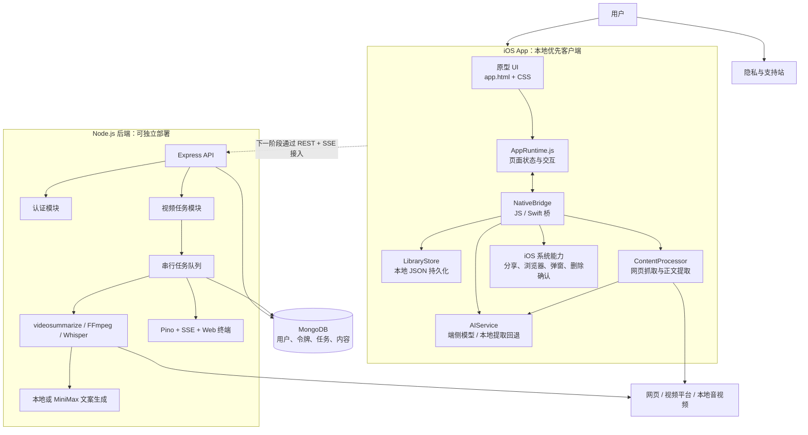
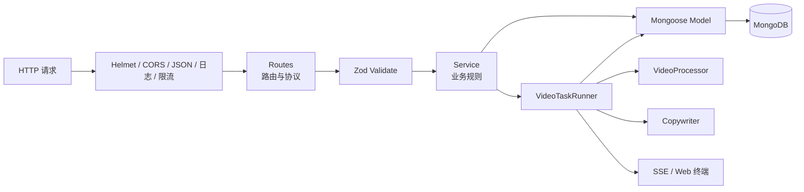
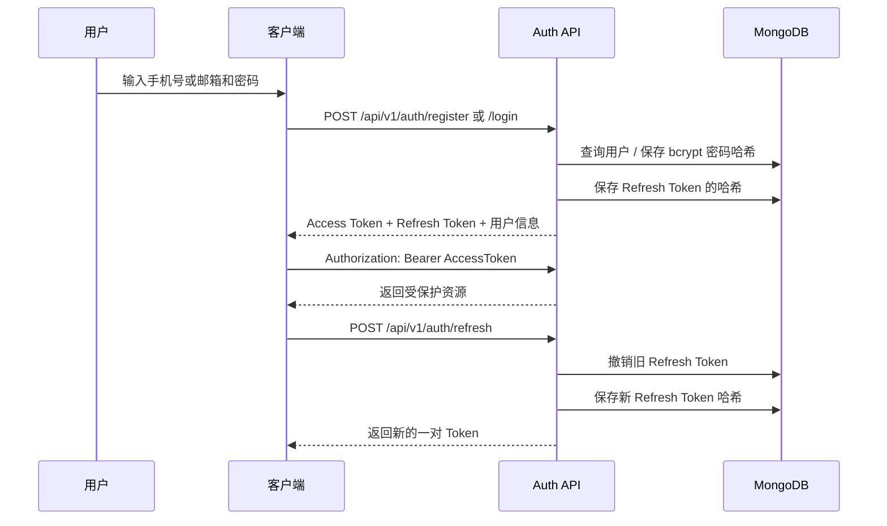
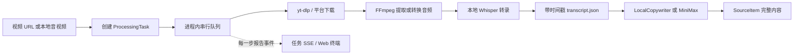
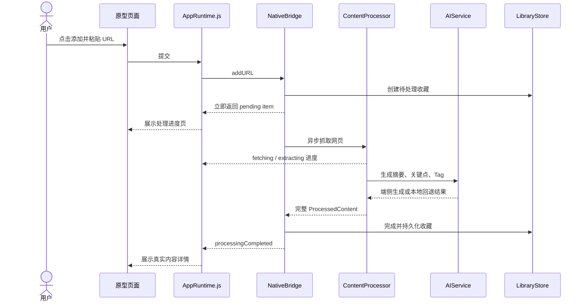
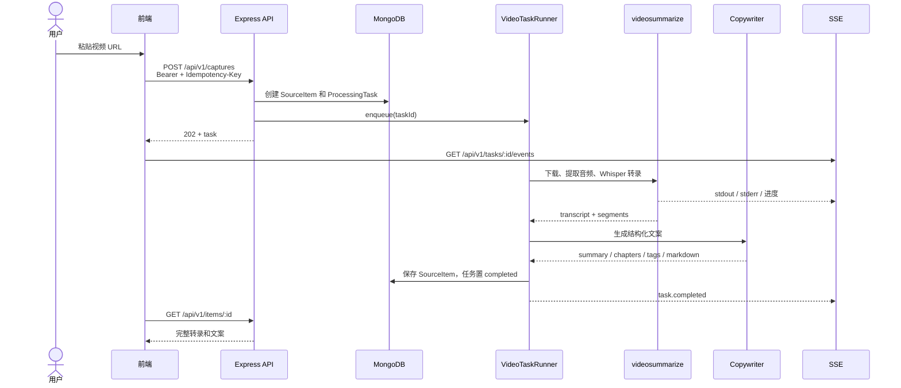

# Memo 完整技术方案与代码导览

> 文档版本：2026-07-20<br>
> 对应仓库：`/Users/mac/Desktop/test/Knowledge`<br>
> 说明：本文以当前仓库中的真实代码为准，讲清楚已经构建的内容、前后端架构、核心用户流程、视频解析链路，以及主要文件的职责。

---

## 1. 一句话说明这个项目

Memo 一期是一个“把网页、文章、播客和视频变成可搜索、可总结的个人知识库”的产品。目前主分支包含：

> 上线范围说明：一期不提供 AI 问答机器人，只发布内容提取、分析、收藏与搜索闭环。完整问答能力保存在 `codex/phase2-ai-chat`（基线提交 `42dff1c`），用于二期继续开发。

1. 一套与原 HTML 原型同源的可安装 iOS App；
2. 一套 Node.js + Express + MongoDB 的独立后端；
3. 一条真实可运行的本地视频下载、音频提取、Whisper 转录和承接文案生成链路；
4. 注册、登录、令牌刷新、内容任务、实时日志、内容列表与详情等 RESTful API；
5. API 文档、OpenAPI、前端接入指南、测试代码和 Web 调试终端；
6. iOS 上架资料、隐私清单以及公开的隐私与支持页面。

它不是简单地“把网页套进壳里”：界面继续使用原型的 HTML/CSS 保证视觉一致，数据保存、网络抓取、内容处理、AI 问答、分享、删除等能力由 iOS 原生代码真实执行。

---

## 2. 当前交付状态与边界

### 2.1 已经完成并验证的部分

| 模块 | 当前状态 | 说明 |
|---|---|---|
| 原型 | 已完成 | `prototype-v2` 提供 12 个移动端产品状态及 Web 展示页 |
| iOS App | 可构建、可运行 | 工程位于 `ios/KnowledgeIOS`，Bundle ID 为 `ai.easelearn.knowledge` |
| iOS 本地交互 | 已实现 | 添加网页、处理进度、保存、搜索、Tag、收藏、删除、分享、打开原文、设置与清空数据 |
| iOS UI 自动化 | 已验证 | 覆盖首次启动、真实链接处理、搜索、Tag、一期无问答入口和设置等流程 |
| iOS Release Archive | 已生成 | 已生成无签名 Archive，证明 Release 构建链路可通过 |
| 后端 API | 已实现 | Express 5 + TypeScript + MongoDB/Mongoose |
| 登录注册 | 已实现 | 密码哈希、JWT Access Token、Refresh Token 轮换与退出 |
| 视频解析 | 已实现 | 视频 URL 和本地音视频上传均有接口 |
| 真实转录 | 已验证 | FFmpeg + 本地 Whisper 可输出带时间戳的 transcript |
| 承接文案 | 已实现 | 本地确定性生成；也预留 MiniMax 接口 |
| 日志与终端 | 已实现 | 服务端结构化日志、任务日志、SSE 实时输出、Web 终端 |
| API 文档 | 已完成 | 中文 API 文档、OpenAPI、前端接入指南、改进总结 |
| 隐私支持站 | 已构建 | 用于 App Store 的隐私与支持说明 |

### 2.2 需要明确区分的三个概念

#### “可运行”不等于“已经发布”

当前 iOS 工程和后端均可在本机运行，Release 无签名 Archive 也已成功生成。但是公开上架还需要 Apple Developer 签名身份、Provisioning Profile 和 App Store Connect 权限。后端公开部署还需要生产 MongoDB、服务器、域名和 HTTPS。

#### “认证已接入”不等于“所有数据已经云端化”

当前 iOS App 已接入后端手机号/邮箱认证：首次打开先完成产品引导，再注册或登录；Access Token 与 Refresh Token 保存在系统 Keychain，并支持会话恢复、刷新和退出。未登录时不会加载收藏、摘要、Tag、搜索和对话，也不能调用原生业务桥接；认证后的内容仍保存在设备中。后端同时提供视频解析、云端内容和日志能力。

也就是说：

- iOS 本地收藏链路是真实可用的；
- 后端视频解析链路也是真实可用的；
- iOS 已加入登录/注册页面、Token 管理和退出登录；
- 但当前 iOS 还没有接入视频上传和后端任务订阅；
- `backend/docs/前端接入指南.md` 已经定义了下一步对接方式。

认证之外继续保持本地优先，避免在后端尚未正式部署时破坏现有 App 的收藏与问答能力。

#### 当前隐私页描述的是“本地优先 iOS 版本”

当前 iOS 要求手机号或邮箱账号，但收藏与对话仍不上传自有内容服务器。公开发布前必须把隐私支持页和 App Store Privacy 申报更新为实际认证数据链路；后续接入云同步或服务器视频解析时还需再次更新。

---

## 3. 总体技术架构



### 3.1 为什么这样拆

这套架构实际上解决了三个不同目标：

1. **视觉不能变**：继续使用原型的 HTML/CSS，避免用 SwiftUI 或 UIKit 重新画一遍造成字号、间距、动画和页面状态偏差；
2. **交互必须真实**：通过 `WKWebView` 与原生 Swift 桥接，让保存、抓取、搜索、分享、删除、AI 等操作真正执行；
3. **后端要能扩展**：把账号、视频解析、任务系统和云端内容做成独立 API，未来可以同时服务 iOS、Web 或其他客户端。

---

## 4. iOS 前端架构

### 4.1 前端采用的不是纯 Web，也不是纯原生重绘

iOS 客户端采用“同源原型 UI + 原生业务能力”的混合架构：

| 层级 | 技术 | 主要职责 |
|---|---|---|
| 展示层 | HTML + CSS | 直接复用原型结构、颜色、字体、间距、动画和 12 个页面状态 |
| 页面运行时 | JavaScript | 接管点击、输入、页面切换、列表渲染、搜索、聊天和处理状态 |
| 容器层 | UIKit + WKWebView | 加载本地原型资源、限制导航、控制全屏与屏幕方向 |
| 桥接层 | `WKScriptMessageHandlerWithReply` | 把 JavaScript 命令传给 Swift，并把执行结果返回页面 |
| 领域层 | Swift Actor / Model | 收藏、对话、内容处理、AI 回答和数据状态 |
| 持久化层 | Application Support JSON | 保存收藏、Tag、对话和设置，写入时采用原子写 |
| 系统能力层 | UIKit / UIApplication | 系统分享、外部链接、设置弹窗、删除确认和隐私说明 |

### 4.2 UI 为什么能保持与原型一致

App 并没有复制原型截图，也没有按照截图重新猜测布局，而是直接把以下源文件打包进 App：

- `prototype-v2/app.html`
- `prototype-v2/styles/tokens.css`
- `prototype-v2/styles/phone-frame.css`

`PrototypeViewController` 在启动时加载打包后的 `app.html`。页面 DOM 和 CSS 与原型同源，所以视觉基线天然一致。iOS 侧只注入必要的适配：

- 手机容器铺满 `100vw × 100vh`；
- 中文字体优先使用 `PingFang SC`；
- 隐藏状态栏并锁定竖屏；
- 为原型按钮和输入框补充无障碍名称，便于 VoiceOver 和 UI 自动化；
- 外部链接交给系统浏览器，不在本地页面中任意跳转。

### 4.3 JavaScript 和 Swift 如何通信

页面通过统一命令调用原生能力：

```text
AppRuntime.js
  → window.webkit.messageHandlers.nativeBridge.postMessage(...)
  → NativeBridge.handle(action, payload)
  → LibraryStore / ContentProcessor / AIService / UIKit
  → Promise 返回结果
  → AppRuntime.js 更新当前页面
```

Swift 也会主动向页面发送事件：

```text
processingUpdated
processingCompleted
processingFailed
itemUpdated
itemDeleted
libraryReset
```

这种双向机制让耗时处理不必卡住页面。用户提交链接后，可以立即看到待处理记录，后续进度和结果通过事件更新。

### 4.4 原生桥接支持的真实动作

| Action | Swift 侧执行内容 |
|---|---|
| `bootstrap` | 读取本地收藏、对话、设置和 AI 模型状态 |
| `addURL` | 校验 URL、创建待处理条目并启动真实抓取 |
| `items` | 获取本地收藏列表 |
| `item` | 获取单条收藏 |
| `search` | 按关键词和 Tag 搜索 |
| `updateTags` | 更新并持久化 Tag |
| `deleteItem` | 弹出原生确认框并删除 |
| `toggleFavorite` | 切换喜欢状态 |
| `retryItem` | 对失败内容重新处理 |
| `chat` | 基于当前收藏或指定收藏生成带引用回答 |
| `completeOnboarding` | 保存已经完成新手引导 |
| `share` | 打开 iOS 系统分享面板 |
| `openURL` | 打开系统浏览器 |
| `showSettings` | 打开原生设置操作表 |
| `reset` | 清空本机 Memo 数据 |

### 4.5 iOS 本地数据结构

#### KnowledgeItem

一条收藏的核心数据，包括：

- 来源 URL、来源名称和内容类型；
- 标题、正文、摘要、关键点和 Tag；
- 是否喜欢；
- 处理状态、进度、状态文案和错误；
- 创建时间与更新时间。

#### Conversation / ChatMessage / ChatCitation

保存知识问答的：

- 用户问题；
- AI 回答；
- 回答引用了哪条收藏；
- 可追溯的原文摘录；
- 对话标题、创建时间和更新时间。

#### AppPreferences

当前主要记录用户是否完成首次引导。

### 4.6 iOS 的内容处理链路

用户提交普通网页 URL 后：

1. `NativeBridge` 校验 URL；
2. `LibraryStore` 先创建一条 pending 收藏，页面立即进入处理态；
3. `ContentProcessor` 用临时 `URLSession` 发起请求；
4. 校验 HTTP 响应、页面大小和编码；
5. 从 HTML 提取标题、描述和可读正文；
6. `AIService` 生成摘要、关键点和 Tag；
7. 如果设备支持相应端侧模型，则使用 Apple 端侧模型；
8. 如果不可用或生成失败，则使用本地句子切分、关键词与规则算法回退；
9. 完整结果写入本机 JSON；
10. Swift 发送 `processingCompleted`，页面切换到真实详情。

### 4.7 本地 AI 的设计

`AIService` 有两种工作路径：

1. **端侧生成路径**：在系统和设备支持时使用 Foundation Models 的 `LanguageModelSession`；
2. **可追溯回退路径**：按问题关键词给收藏排序，从原文中选取最相关句子并返回引用。

回退方案的价值是：

- 没有外部 API Key 也能使用；
- 不会因为模型不可用导致核心流程完全失效；
- 回答能明确引用本地收藏，降低无依据生成；
- 收藏内容默认不离开设备。

---

## 5. 后端架构

### 5.1 技术栈

| 分类 | 技术 | 用途 |
|---|---|---|
| 运行时 | Node.js 22+ | 后端运行环境 |
| API 框架 | Express 5 | RESTful API 和中间件 |
| 语言 | TypeScript | 类型约束和可维护性 |
| 数据库 | MongoDB | 用户、令牌、任务与内容持久化 |
| ODM | Mongoose 8 | Schema、索引和数据访问 |
| 输入验证 | Zod 4 | 环境变量、Body、Query 和 Params 校验 |
| 认证 | JOSE + JWT | Access Token 签发与验证 |
| 密码 | bcryptjs | 密码单向哈希 |
| 上传 | Multer | 音视频 multipart 上传 |
| 安全 | Helmet、CORS、Rate Limit | 安全响应头、跨域白名单和限流 |
| 日志 | Pino | JSON 结构化日志 |
| 实时通信 | SSE | 任务日志和 Web 终端实时输出 |
| 测试 | Vitest、Supertest、MongoDB Memory Server | 接口和处理链路验证 |

本地数据库连接方式已经明确配置为：

```text
mongodb://localhost:27017/memo_knowledge
```

生产环境需要把它替换成生产 MongoDB URI，并使用独立账号、网络白名单、备份和 TLS。

### 5.2 后端的模块分层



后端采用“按功能模块组织、模块内再分路由/服务/模型”的方式，而不是把全部接口堆在一个文件中。

#### shared

提供所有模块共用的基础设施：

- 数据库连接；
- 标准成功响应；
- 输入验证；
- 统一错误；
- 请求日志；
- JWT 验证；
- SSE 事件总线。

#### features/auth

只负责账户和会话：

- 注册；
- 登录；
- 当前用户；
- Refresh Token 轮换；
- 退出和令牌撤销。

#### features/video

负责视频领域的完整生命周期：

- 接收 URL 或上传文件；
- 创建幂等任务；
- 任务串行排队；
- 调用真实解析器；
- 生成承接文案；
- 保存 transcript 和内容；
- 查询任务、列表和详情；
- 软删除。

#### features/terminal

把服务端事件通过 SSE 输出给浏览器中的 Web 终端，便于看到：

- 收到的 HTTP 请求；
- 视频处理启动；
- CLI stdout / stderr；
- 转录结果；
- 文案生成结果；
- 任务成功或失败。

### 5.3 后端请求生命周期

一个普通 API 请求会按以下顺序经过系统：

1. Helmet 增加安全响应头；
2. CORS 检查来源是否在白名单；
3. Express 解析 JSON；
4. Request Logger 生成或继承 `X-Request-Id`；
5. Rate Limit 做请求限流；
6. 路由匹配；
7. Zod 校验 Body、Query 或 Params；
8. 受保护接口验证 Bearer Access Token；
9. Service 执行业务规则；
10. Mongoose 读写 MongoDB；
11. 使用统一的成功或失败响应格式返回；
12. 请求过程写入 Pino 和 SSE 事件流。

### 5.4 认证方案

认证采用 Access Token + Refresh Token：



关键安全点：

- 数据库不保存明文密码；
- 数据库不保存明文 Refresh Token，只保存 SHA-256 哈希；
- Refresh Token 使用一次后立即撤销，降低重放风险；
- Access Token 默认短时有效；
- 退出时撤销当前 Refresh Token；
- 正式环境必须替换默认 JWT Secret。

### 5.5 后端数据模型

#### User

| 字段 | 作用 |
|---|---|
| `email` | 可选邮箱登录标识，稀疏唯一索引 |
| `phone` | 可选 E.164 手机号登录标识，稀疏唯一索引 |
| `passwordHash` | bcrypt 哈希，默认查询不返回 |
| `nickname` | 用户昵称 |
| `createdAt / updatedAt` | 创建和更新时间 |

#### RefreshToken

| 字段 | 作用 |
|---|---|
| `userId` | 所属用户 |
| `tokenHash` | Refresh Token 哈希 |
| `expiresAt` | 过期时间，并配置 TTL 索引 |
| `revokedAt` | 被刷新或退出后记录撤销时间 |

#### ProcessingTask

| 字段 | 作用 |
|---|---|
| `userId` | 任务所属用户 |
| `sourceItemId` | 对应内容 |
| `inputType` | `url` 或 `upload` |
| `source` | URL 或服务器本地上传路径 |
| `quality` | `fast / balanced / accurate` |
| `language` | `zh / en / ja / auto` |
| `idempotencyKey` | 防止重复提交 |
| `status` | `queued / processing / completed / failed` |
| `stage / progress` | 当前阶段与百分比 |
| `logs` | 最多保留最近 500 条任务日志 |
| `error` | 失败代码和失败原因 |

数据库使用 `{ userId, idempotencyKey }` 唯一索引，从数据层防止同一用户重复创建相同任务。

#### SourceItem

| 字段 | 作用 |
|---|---|
| `type` | 视频或音频 |
| `platform` | YouTube、B站、抖音、小红书、西瓜视频、本地上传等 |
| `url` | 原始视频地址，可选 |
| `title / status / tags` | 内容展示信息 |
| `transcript` | 全文、时间戳分段、文件路径和 provider |
| `copywriting` | 摘要、关键点、章节、行动项、Tag 和 Markdown |
| `deletedAt` | 软删除标记 |
| `version` | 内容版本 |

列表接口默认不返回完整 `transcript.text`，避免列表响应过大；只有详情接口返回完整内容。

---

## 6. 视频解析与文案生成方案

### 6.1 采用的核心路线

后端没有重新实现一套未经验证的视频下载和 Whisper 工具，而是复用了：

```text
/Users/mac/Desktop/03_学习与研究/study/视频解析学习/skill方案
```

中的 `videosummarize` 能力，并在 Node.js 服务中增加适配器。整体路线是：



本地上传文件不需要再经过视频平台下载，而是由 Python 桥直接调用已有 extractor 和 transcriber：

```text
本地文件 → FFmpeg → Whisper → transcript.json
```

### 6.2 为什么任务队列是串行的

当前队列是单 Node.js 进程内的 Promise 串行队列。这样做的主要原因不是性能，而是可靠性：

- 避免多个 Whisper / MLX 进程同时抢占 GPU 和内存；
- 降低本地开发环境中大模型进程互相影响；
- 保证终端日志更容易对应到具体任务；
- 当前阶段不需要额外引入 Redis 和队列服务。

它适合本机验证和小规模部署。正式生产并发增加后，应替换成 Redis + BullMQ 等持久化队列，并把转录 Worker 独立部署。

### 6.3 质量档位如何映射模型

| API 质量参数 | Whisper 模型 |
|---|---|
| `fast` | `base` |
| `balanced` | `small` |
| `accurate` | `large-v3` |

质量越高，通常转录更准确，但下载、计算和内存成本更高。

### 6.4 承接文案包含什么

转录完成后，Copywriter 生成：

- 一句话总结；
- 为什么值得看；
- 关键观点；
- 带起止时间的章节；
- 可执行动作；
- 自动 Tag；
- 可直接保存或展示的完整 Markdown；
- 当前使用的 provider。

#### 本地模式

默认 `COPYWRITER_PROVIDER=local`。它不需要 API Key，使用确定性规则从 transcript 中生成结构化内容，适合：

- 本地开发；
- 离线或隐私敏感场景；
- 自动化测试；
- 外部大模型不可用时兜底。

#### MiniMax 模式

设置以下环境变量后可切换到 MiniMax OpenAI 兼容接口：

```text
COPYWRITER_PROVIDER=minimax
MINIMAX_API_KEY=你的 API Key
MINIMAX_API_BASE=https://api.minimaxi.com
MINIMAX_MODEL=MiniMax-M3
```

MiniMax 适合生成更自然、更高质量的总结和文案，但依赖网络、费用和外部服务可用性。

### 6.5 任务恢复

服务器启动时会检查数据库：

- 原来处于 `processing` 的任务被重置为 `queued`；
- 写入一条 `task.recovered` 日志；
- 所有 queued 任务按创建时间重新入队。

这能避免服务意外重启后任务永久卡在“处理中”。

---

## 7. 核心用户流程

### 7.1 iOS 本地收藏普通网页



失败时会保存失败状态和错误信息，用户可以触发 `retryItem` 再次处理。

### 7.2 搜索、Tag 与收藏管理

1. App 启动时通过 `bootstrap` 载入全部本地状态；
2. 搜索框输入时，JavaScript 调用 `search`；
3. `LibraryStore` 对标题、摘要、正文、来源和 Tag 进行匹配和排序；
4. 点击结果进入真实详情；
5. 用户可以编辑 Tag、切换喜欢、系统分享、打开原文或删除；
6. 每次修改都先更新 Store，再原子写入本机文件；
7. Swift 主动发事件，列表和详情同步刷新。

### 7.3 基于收藏问 AI

1. 用户可以在单篇详情中提问，也可以对整个知识库提问；
2. 单篇提问只把当前收藏作为证据范围；
3. 全库提问会先按关键词对收藏进行相关度排序；
4. 最相关的最多 5 条内容进入回答上下文；
5. 回答同时返回引用编号、收藏标题、原文摘录和来源；
6. 问题、回答和引用保存到本地 Conversation；
7. 用户可以在历史对话中继续查看。

### 7.4 注册与登录

1. 前端提交手机号或邮箱、密码和可选昵称；
2. Zod 校验格式和密码强度；
3. 服务端规范化登录标识并检查手机号或邮箱唯一性；
4. bcrypt 以 cost 12 生成密码哈希；
5. 创建 User；
6. 生成 JWT Access Token 和随机 Refresh Token；
7. 只把 Refresh Token 哈希保存到 MongoDB；
8. 返回用户信息和 Token；
9. 后续接口携带 `Authorization: Bearer <accessToken>`；
10. Access Token 过期时用 Refresh Token 获取新的一对 Token。

### 7.5 提交视频 URL



### 7.6 上传本地音视频

与 URL 流程基本一致，区别是：

- 使用 `POST /api/v1/captures/upload`；
- 请求类型为 `multipart/form-data`；
- 文件字段名必须是 `file`；
- 支持 `.mp4`、`.mov`、`.m4a`、`.mp3`、`.wav`、`.webm`；
- 单文件最大 512 MB；
- 处理时调用 `scripts/transcribe-local.py`；
- 删除内容时会尝试删除对应上传文件。

### 7.7 查看终端执行过程

本地开发开启 Web 终端后：

1. 浏览器打开 `/terminal/`；
2. 页面使用终端 Token 连接 `/api/v1/logs/stream`；
3. SSE 先返回最近 200 条日志；
4. 后续请求、CLI 输出和任务事件实时追加；
5. 每 20 秒发送 heartbeat，保持连接。

任务自己的前端页面应优先订阅 `/api/v1/tasks/:id/events`，这样只会收到当前用户已经鉴权且有权限查看的任务事件。

---

## 8. 主要 API 速览

完整成功响应、失败响应和字段定义见 `backend/api.md` 与 `backend/docs/openapi.yaml`。

| 方法 | URL | 鉴权 | 作用 |
|---|---|---:|---|
| `GET` | `/health` | 否 | 进程健康检查 |
| `GET` | `/ready` | 否 | 数据库就绪检查 |
| `POST` | `/api/v1/auth/register` | 否 | 注册 |
| `POST` | `/api/v1/auth/login` | 否 | 登录 |
| `POST` | `/api/v1/auth/refresh` | 否 | 刷新并轮换 Token |
| `POST` | `/api/v1/auth/logout` | 否 | 撤销 Refresh Token |
| `GET` | `/api/v1/auth/me` | 是 | 当前用户 |
| `POST` | `/api/v1/captures` | 是 | 提交视频 URL |
| `POST` | `/api/v1/captures/upload` | 是 | 上传本地音视频 |
| `GET` | `/api/v1/tasks/:id` | 是 | 查询任务状态 |
| `GET` | `/api/v1/tasks/:id/events` | 是 | 订阅任务实时事件 |
| `GET` | `/api/v1/items` | 是 | 分页查询内容 |
| `GET` | `/api/v1/items/:id` | 是 | 查询完整内容 |
| `DELETE` | `/api/v1/items/:id` | 是 | 软删除内容 |
| `GET` | `/api/v1/logs/stream?token=...` | 终端 Token | 本地 Web 终端事件流 |
| `GET` | `/docs/openapi.yaml` | 否 | OpenAPI 文件 |
| `GET` | `/terminal/` | 本地配置 | Web 调试终端 |

标准成功响应：

```json
{
  "success": true,
  "data": {},
  "requestId": "..."
}
```

标准失败响应：

```json
{
  "success": false,
  "error": {
    "code": "VALIDATION_ERROR",
    "message": "请求参数不符合要求",
    "details": []
  },
  "requestId": "..."
}
```

---

## 9. 文件级代码导览

> 下面覆盖需要维护和理解的源代码、配置、文档、测试与关键资源。`node_modules`、`dist`、Xcode DerivedData、`.git` 等第三方依赖或生成目录不逐文件解释；`build/*.xcarchive` 作为构建产物单独说明。

### 9.1 仓库根目录

| 文件或目录 | 作用 |
|---|---|
| `prototype-v2/` | iOS App 和浏览器预览共同使用的原型视觉基线 |
| `prototype-v2_副本/` | 原型备份副本，不参与当前 iOS 构建 |
| `ios/KnowledgeIOS/` | 可安装的 iOS App 工程 |
| `backend/` | Node.js + Express + MongoDB 后端 |
| `privacy-site/` | App Store 隐私与支持网站 |
| `Build-iOS-Apps-插件分析.md` | 对构建 iOS App 所用能力和方案的前期分析，不是运行时代码 |
| `Memo完整技术方案与代码导览.md` | 当前这份总体架构、流程与文件说明 |

### 9.2 原型文件

| 文件 | 作用 |
|---|---|
| `prototype-v2/app.html` | iOS 实际打包使用的完整单页原型，包含 12 个页面状态 |
| `prototype-v2/app.html.bak` | `app.html` 的人工备份，不参与构建 |
| `prototype-v2/index.html` | 原型入口或展示入口 |
| `prototype-v2/index.showcase-backup.html` | 原型展示页备份 |
| `prototype-v2/web.html` | Web 尺寸的综合预览页 |
| `prototype-v2/home-preview.png` | 首页视觉预览图 |
| `prototype-v2/styles/tokens.css` | 颜色、字体、圆角、间距等设计 Token |
| `prototype-v2/styles/phone-frame.css` | 手机框架、屏幕尺寸和外层展示样式 |
| `prototype-v2/screens/mobile/index.html` | 移动页面索引 |
| `prototype-v2/screens/mobile/01-home.html` | 有收藏数据的首页 |
| `prototype-v2/screens/mobile/02-home-empty.html` | 空收藏首页 |
| `prototype-v2/screens/mobile/03-add.html` | 添加链接页面 |
| `prototype-v2/screens/mobile/04-detail-podcast.html` | 播客/音视频详情 |
| `prototype-v2/screens/mobile/05-ai-chat.html` | 有上下文的 AI 对话页 |
| `prototype-v2/screens/mobile/06-detail-article.html` | 文章详情页 |
| `prototype-v2/screens/mobile/07-processing.html` | 内容处理进度页 |
| `prototype-v2/screens/mobile/08-search.html` | 搜索页 |
| `prototype-v2/screens/mobile/09-onboarding.html` | 首次启动引导 |
| `prototype-v2/screens/mobile/10-unsupported.html` | 不支持来源提示 |
| `prototype-v2/screens/mobile/11-edit-tags.html` | Tag 编辑页 |
| `prototype-v2/screens/mobile/12-ai-empty.html` | AI 助手空状态和对话历史入口 |
| `prototype-v2/screens/web/web-home.html` | Web 首页状态 |
| `prototype-v2/screens/web/web-add.html` | Web 添加状态 |
| `prototype-v2/screens/web/web-ai.html` | Web AI 状态 |

`prototype-v2_副本/` 中的文件与上述原型结构对应，仅作为备份，不应在两边同时修改。正式视觉基线以 `prototype-v2/` 为准。

### 9.3 iOS 工程与配置

| 文件 | 作用 |
|---|---|
| `ios/KnowledgeIOS/project.yml` | XcodeGen 工程定义：Target、Scheme、Bundle ID、最低 iOS 版本、资源和构建配置 |
| `ios/KnowledgeIOS/KnowledgeIOS.xcodeproj/project.pbxproj` | 生成后的 Xcode 工程配置 |
| `ios/KnowledgeIOS/KnowledgeIOS.xcodeproj/project.xcworkspace/contents.xcworkspacedata` | Xcode Workspace 元数据 |
| `ios/KnowledgeIOS/KnowledgeIOS.xcodeproj/xcshareddata/xcschemes/KnowledgeIOS.xcscheme` | 可共享的构建和测试 Scheme |
| `ios/KnowledgeIOS/README.md` | 打开工程、生成工程和指定原型页面启动的方法 |

工程关键配置：

- Product Name：`Memo`
- Bundle ID：`ai.easelearn.knowledge`
- 最低系统：iOS 17.0
- Swift：6.0
- 设备：仅 iPhone
- 方向：仅竖屏
- Scheme：`KnowledgeIOS`

### 9.4 iOS 运行时代码

| 文件 | 作用 |
|---|---|
| `KnowledgeIOS/AppDelegate.swift` | App 入口，创建主窗口并将 `PrototypeViewController` 设为根控制器 |
| `KnowledgeIOS/PrototypeViewController.swift` | 创建 WKWebView、加载本地原型、注入运行时和适配 CSS、管理页面导航与 Swift → JS 事件 |
| `KnowledgeIOS/AppRuntime.js` | 页面运行时；把静态原型变为真实 App，负责页面点击、表单、列表、搜索、详情、处理状态、聊天与设置交互 |
| `KnowledgeIOS/NativeBridge.swift` | JavaScript ↔ Swift 业务桥；分发动作、调用原生服务并向页面推送状态事件 |
| `KnowledgeIOS/Models.swift` | 收藏、对话、引用、偏好、处理结果等共享数据模型 |
| `KnowledgeIOS/LibraryStore.swift` | 本地状态中心；实现增删改查、搜索、对话保存、首次引导状态和 JSON 原子持久化 |
| `KnowledgeIOS/ContentProcessor.swift` | 真实抓取 URL、检查响应、解析 HTML 元数据和正文，并调用 AI 生成增强内容 |
| `KnowledgeIOS/AIService.swift` | 端侧摘要和知识问答；不支持端侧模型时使用本地可追溯算法回退 |
| `KnowledgeIOS/PrivacyInfo.xcprivacy` | Apple Privacy Manifest，声明 App 使用的数据与系统 API 情况 |

### 9.5 iOS 资源、测试和发布文件

| 文件 | 作用 |
|---|---|
| `KnowledgeIOS/Assets.xcassets/Contents.json` | Xcode Asset Catalog 根配置 |
| `KnowledgeIOS/Assets.xcassets/AppIcon.appiconset/Contents.json` | App Icon 资源声明 |
| `KnowledgeIOS/Assets.xcassets/AppIcon.appiconset/AppIcon-1024.png` | App Store 与系统生成各尺寸图标使用的 1024 图标 |
| `KnowledgeIOSUITests/KnowledgeIOSUITests.swift` | 6 条 iOS UI 自动化流程，并提供测试用 URL 收藏和启动环境控制 |
| `tools/GenerateAppIcon.swift` | 生成 App 图标的辅助脚本 |
| `AppStore/AppStoreMetadata.md` | App Store 名称、描述、关键词、审核备注、隐私建议和待填写项 |
| `build/Memo-unsigned-v2.xcarchive/` | 已成功生成的最新无签名 Release Archive；用于证明可归档，但不能直接上传商店 |
| `build/Memo-unsigned.xcarchive/` | 较早一次无签名 Archive，可视为历史构建产物 |

### 9.6 后端根配置与入口

| 文件 | 作用 |
|---|---|
| `backend/package.json` | 依赖、Node 版本要求、开发/构建/测试/冒烟命令 |
| `backend/package-lock.json` | 锁定实际依赖版本，保证不同机器安装结果一致 |
| `backend/tsconfig.json` | TypeScript 编译规则 |
| `backend/vitest.config.ts` | Vitest 测试配置 |
| `backend/.env.example` | 全部环境变量示例，包括 MongoDB、JWT、视频解析器、MiniMax 和 Web 终端 |
| `backend/.gitignore` | 忽略依赖、构建产物、环境密钥、上传内容和运行工作区 |
| `backend/src/config.ts` | 使用 Zod 校验环境变量，并生成强类型 `AppConfig` |
| `backend/src/app.ts` | Express 应用工厂；组装中间件、路由、处理器和文案 provider，也便于测试注入 Mock |
| `backend/src/server.ts` | 服务启动入口；连接数据库、恢复任务、监听端口和优雅关闭 |
| `backend/src/types/express.d.ts` | 扩展 Express Request 类型，补充 `auth` 和 `requestId` 等字段 |

### 9.7 后端认证模块

| 文件 | 作用 |
|---|---|
| `src/features/auth/auth.routes.ts` | 注册、登录、刷新、退出和当前用户路由 |
| `src/features/auth/auth.schemas.ts` | 手机号/邮箱标识、密码、昵称和 Refresh Token 的 Zod 校验与规范化 |
| `src/features/auth/auth.service.ts` | 注册登录业务、bcrypt 校验、Token 签发、轮换和撤销 |
| `src/features/auth/user.model.ts` | User 的 Mongoose Schema，以及手机号和邮箱的稀疏唯一索引 |
| `src/features/auth/refresh-token.model.ts` | Refresh Token 哈希、过期时间、撤销时间和 TTL 索引 |

### 9.8 后端视频模块

| 文件 | 作用 |
|---|---|
| `src/features/video/video.routes.ts` | 视频 URL、文件上传、任务、SSE、内容列表/详情/删除路由 |
| `src/features/video/video.schemas.ts` | 平台 URL、质量、语言、Mongo ID 和列表分页参数校验 |
| `src/features/video/video.service.ts` | 创建幂等任务、平台判断、内容查询、分页和软删除 |
| `src/features/video/video.types.ts` | Processor、Copywriter、Transcript、Chapter 和 Copywriting 的接口契约 |
| `src/features/video/processing-task.model.ts` | ProcessingTask Schema、日志子结构和幂等唯一索引 |
| `src/features/video/source-item.model.ts` | SourceItem、时间戳分段、全文搜索索引和软删除字段 |
| `src/features/video/task-runner.ts` | 串行执行队列、阶段更新、日志记录、成功/失败落库和重启恢复 |
| `src/features/video/videosummarize.processor.ts` | 真实处理器适配器；调用 videosummarize CLI 或本地 Python 转录桥 |
| `src/features/video/mock-video.processor.ts` | 测试用模拟视频处理器，不调用真实下载和 Whisper |
| `src/features/video/local-copywriter.ts` | 无外部 API 的确定性承接文案生成器 |
| `src/features/video/minimax-copywriter.ts` | MiniMax OpenAI 兼容 API 的文案生成适配器，支持通过环境变量换模，并校验、归一化模型输出 |

### 9.9 后端共享基础设施

| 文件 | 作用 |
|---|---|
| `src/shared/db/mongoose.ts` | MongoDB 连接、断开和就绪状态 |
| `src/shared/errors/app-error.ts` | 带 HTTP 状态、业务错误码和 details 的标准错误 |
| `src/shared/errors/error-handler.ts` | 404 和全局错误处理中间件，统一错误响应并记录日志 |
| `src/shared/http/response.ts` | 标准成功响应封装 |
| `src/shared/http/validate.ts` | 把 Zod Schema 包装成 Express 校验中间件 |
| `src/shared/logger/logger.ts` | 创建 Pino Logger，并做敏感字段脱敏配置 |
| `src/shared/logger/request-logger.middleware.ts` | 请求 ID、请求开始/结束、状态码和耗时日志 |
| `src/shared/logger/event-bus.ts` | 内存事件总线和最近事件缓冲，为 SSE 与 Web 终端供数 |
| `src/shared/security/tokens.ts` | 创建/校验 JWT、创建 Refresh Token、哈希 Token |
| `src/shared/security/auth.middleware.ts` | 校验 Bearer Token，并把用户身份写入 Request |

### 9.10 健康检查与 Web 终端

| 文件 | 作用 |
|---|---|
| `src/features/health/health.routes.ts` | `/health` 和 `/ready`，区分进程存活与数据库就绪 |
| `src/features/terminal/terminal.routes.ts` | 带终端 Token 的全局 SSE 日志接口 |
| `public/terminal.html` | 浏览器调试终端界面，实时显示请求、响应和视频处理事件 |

### 9.11 后端脚本和运行目录

| 文件或目录 | 作用 |
|---|---|
| `scripts/transcribe-local.py` | 本地上传桥；复用已有 Python extractor/transcriber，输出 transcript JSON |
| `scripts/smoke.ts` | 使用内存 MongoDB 启动真实 Express，打印注册、鉴权、建任务、转录、文案和查询每一步结果 |
| `storage/uploads/.gitkeep` | 保留上传目录；真实上传文件不会提交 Git |
| `storage/workspaces/.gitkeep` | 保留视频处理工作区；运行产生的音频和 transcript 不提交 Git |

### 9.12 后端测试

| 文件 | 作用 |
|---|---|
| `tests/api.integration.test.ts` | API 集成测试：健康、注册登录、刷新轮换、错误认证、任务幂等、内容查询和删除 |
| `tests/videosummarize-cli.test.ts` | 运行 videosummarize doctor，检查 FFmpeg、yt-dlp 和 Whisper 环境 |
| `tests/real-local-video.test.ts` | 系统合成语音 → FFmpeg → 本地 Whisper → 带时间戳文本的真实测试；通过环境变量显式启用 |

### 9.13 后端文档

| 文件 | 作用 |
|---|---|
| `backend/README.md` | 后端能力、启动、验证和 MiniMax 配置的快速说明 |
| `backend/api.md` | 中文 RESTful API 文档，包含成功/失败响应和请求示例 |
| `backend/docs/openapi.yaml` | 可导入 Swagger、Postman 或 API 客户端的机器可读契约 |
| `backend/docs/前端接入指南.md` | TypeScript 类型、登录封装、任务跟踪、UI 状态和时间戳跳转建议 |
| `backend/docs/视频解析方案与改进总结.md` | 方案选择、复用路径、文案结构、验证结果、边界与下一步 |

### 9.14 隐私与支持网站

| 文件 | 作用 |
|---|---|
| `privacy-site/app/page.tsx` | 中文隐私政策和英文摘要的主页面 |
| `privacy-site/app/layout.tsx` | 页面根布局、字体、标题、OG 和站点元数据 |
| `privacy-site/app/globals.css` | 隐私页完整视觉样式和响应式规则 |
| `privacy-site/app/chatgpt-auth.ts` | Sites 运行环境可选认证辅助代码 |
| `privacy-site/package.json` | React/Next/vinext 构建、开发、测试和部署依赖 |
| `privacy-site/package-lock.json` | 锁定网站依赖 |
| `privacy-site/next.config.ts` | Next 配置 |
| `privacy-site/vite.config.ts` | vinext/Vite 构建配置 |
| `privacy-site/postcss.config.mjs` | PostCSS/Tailwind 处理配置 |
| `privacy-site/eslint.config.mjs` | ESLint 规则 |
| `privacy-site/tsconfig.json` | 网站 TypeScript 配置 |
| `privacy-site/worker/index.ts` | Cloudflare Worker 运行入口及图片处理 |
| `privacy-site/build/sites-vite-plugin.ts` | Sites 构建集成插件 |
| `privacy-site/tests/rendered-html.test.mjs` | 服务端渲染 HTML 的自动化验证 |
| `privacy-site/db/index.ts` | 可选 Drizzle 数据库入口；当前隐私静态页不依赖业务数据库 |
| `privacy-site/db/schema.ts` | 可选数据库 Schema 占位 |
| `privacy-site/drizzle.config.ts` | Drizzle 迁移配置 |
| `privacy-site/drizzle/meta/_journal.json` | Drizzle 迁移元数据 |
| `privacy-site/examples/d1/app/api/notes/route.ts` | D1 数据库示例路由，不属于 Memo 核心业务 |
| `privacy-site/examples/d1/db/schema.ts` | D1 示例 Schema，不属于 Memo 核心业务 |
| `privacy-site/public/icon.png` | 站点图标 |
| `privacy-site/public/og.png` | 社交分享预览图 |
| `privacy-site/public/favicon.svg` | 浏览器 Favicon |
| `privacy-site/public/file.svg` | 模板静态图标 |
| `privacy-site/public/globe.svg` | 模板静态图标 |
| `privacy-site/public/window.svg` | 模板静态图标 |
| `privacy-site/README.md` | vinext/Sites 工程的启动与部署说明 |

---

## 10. 本地启动与验证方式

### 10.1 iOS

```bash
cd /Users/mac/Desktop/test/Knowledge/ios/KnowledgeIOS
xcodegen generate
open KnowledgeIOS.xcodeproj
```

在 Xcode 中选择 `KnowledgeIOS` Scheme 和 iPhone Simulator 后运行。

原型状态可以通过启动环境变量 `KNOWLEDGE_SCREEN` 直达，例如：

```text
01-home
02-home-empty
...
12-ai-empty
```

### 10.2 后端

先确保本地 MongoDB 运行，并在启动前清理旧的 3100 端口服务，避免多实例：

```bash
cd /Users/mac/Desktop/test/Knowledge/backend
cp .env.example .env
npm install
npm run dev
```

默认地址：

```text
API:       http://127.0.0.1:3100
MongoDB:   mongodb://localhost:27017/memo_knowledge
终端:      http://127.0.0.1:3100/terminal/
OpenAPI:   http://127.0.0.1:3100/docs/openapi.yaml
```

### 10.3 测试命令

```bash
cd /Users/mac/Desktop/test/Knowledge/backend
npm run typecheck
npm test
npm run build
npm audit --audit-level=high
npm run smoke
RUN_REAL_VIDEO_TEST=1 npx vitest run tests/real-local-video.test.ts
```

历史验证结果：

- TypeScript typecheck 通过；
- 常规测试 6 passed，真实耗时测试默认跳过；
- 真实本地语音/Whisper 测试 1 passed；
- 后端 build 通过；
- 高危依赖审计为 0；
- smoke 覆盖注册、鉴权、建任务、转录、文案和查询；
- Web 终端与 OpenAPI 均验证返回 200；
- iOS 6 条 UI 自动化通过；
- iOS Release 无签名 Archive 成功。

---

## 11. 当前方案的优点、限制与后续路线

### 11.1 当前方案的主要优点

1. **视觉一致性高**：iOS 与原型同源，不依赖人工重绘；
2. **交互不是假按钮**：核心行为连接到真实 Swift 服务和本地数据；
3. **本地优先可独立工作**：没有后端或 API Key 时仍能收藏、搜索、摘要和问答；
4. **后端模块化**：认证、视频、日志、公共设施职责分明；
5. **视频链路真实**：不是返回模拟结果，而是实际执行 FFmpeg 和 Whisper；
6. **有失败与恢复机制**：统一错误、任务失败状态、重试和重启恢复；
7. **可观测**：请求和视频解析过程可以在 Web 终端中实时查看；
8. **易于接入**：RESTful API、OpenAPI 和前端接入指南已经齐全。

### 11.2 当前限制

1. iOS 已接入后端账号，但还没有接入视频任务；
2. 本地进程内串行队列不适合多实例和高并发生产环境；
3. 上传文件保存在服务器本地磁盘，生产环境应改为对象存储；
4. 视频平台解析依赖平台页面、Cookie 和下载工具，平台变化可能导致失败；
5. 默认本地文案质量稳定但不等于大模型的语言质量；
6. 当前 iOS Archive 无签名，不能直接上传 App Store；
7. 还没有生产 MongoDB、正式域名、HTTPS、监控告警和备份方案；
8. 认证接入后必须更新公开隐私政策；云端处理上线时还需按实际数据链路再次更新。

### 11.3 推荐的下一阶段顺序

#### 第一阶段：继续把视频后端接入 iOS

1. 配置生产认证服务 URL、HTTPS 和正式密钥；
2. 新增视频 URL/上传调用；
3. 将后端任务状态映射到当前 `07-processing` 原型页；
4. 用 SSE 更新进度，完成后进入现有详情页；
5. 保留当前本地网页收藏能力，形成“本地网页 + 云端视频”的双路径。

#### 第二阶段：生产化后端

1. MongoDB Atlas 或自建 MongoDB；
2. Redis + BullMQ；
3. 独立 Whisper Worker；
4. 对象存储和生命周期清理；
5. HTTPS、密钥管理、日志平台、监控和告警；
6. 备份、恢复和数据删除流程；
7. 全链路限流、上传扫描和 SSRF 防护。

#### 第三阶段：正式发布

1. 获取 Apple Developer 和 App Store Connect 权限；
2. 配置签名证书与 Provisioning Profile；
3. 更新 App Privacy 和隐私政策；
4. 准备截图、支持邮箱、服务条款和审核账号；
5. 真机回归；
6. 生成签名 Archive 并上传 TestFlight；
7. TestFlight 验收后提交审核。

---

## 12. 最终结论

当前仓库已经形成了一个完整的“产品原型 → 可运行 iOS 客户端 → 独立后端 → 真实视频转录 → 结构化文案 → API 与测试文档”的技术闭环。

前端的核心设计是：**不重画原型，而是让原型本身成为真实 App 的展示层，再用 Swift 接管业务能力。**

后端的核心设计是：**把认证、异步视频任务、真实本地 Whisper、文案生成、MongoDB 持久化和实时日志拆成可替换模块。**

现在真正还缺的不是“再做一个演示”，而是生产整合：把后端认证和视频任务接入 iOS、配置生产基础设施、完成 Apple 签名与上架权限。完成这些之后，才可以准确地称为“已经完整对外发布”。
