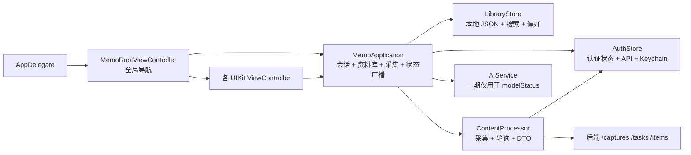
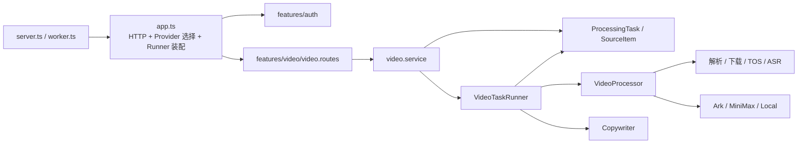
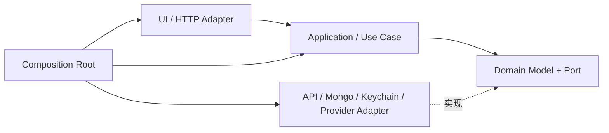

# Memo 架构重组与组件化拆分方案（审批稿）

> 状态：待审批
> 规划分支：`codex/architecture-reorganization`
> 基线：`main@406f9d21252a5dc02ada32ad185818874cdcbe38`
> 参考文档：[飞书《工作树、分支与前后端重构逻辑》](https://vrfi1sk8a0.feishu.cn/docx/J0tsdiFAVopk2axFgaTcZFTjnTf)
> 本稿只定义边界、目录、迁移顺序和验收标准；审批前不实施代码重构。

## 1. 审批结论先行

这次不建议做一次“把文件搬漂亮”的大重构。真正要解决的是四个结构问题：

1. **iOS 的 `MemoApplication` 是总业务入口**：认证、资料库、采集、任务进度、删除和页面状态都经过它，任何功能改动都容易碰同一个中心文件。
2. **iOS 的网络、本地存储和业务模型混在大文件中**：`AuthService.swift` 同时包含会话状态、API Client、DTO、校验和 Keychain；`ContentProcessor.swift` 同时包含采集流程、后端轮询、DTO，以及当前主链路已不再使用的网页解析代码。
3. **iOS 与后端存在资料库“双数据源”**：服务端保存 `SourceItem`，iOS 又把处理结果复制到本地 JSON；列表和搜索只读本地，服务端也提供列表、详情和删除接口，两边的所有权没有统一。
4. **后端的 `features/video` 是新的总模块**：它同时负责采集、资料库、任务队列、媒体下载、ASR、模型调用、对象存储和 MongoDB 模型，24 个文件、约 4,700 行代码集中在同一个平面目录。

建议批准下面的总体方向：

- **组织方式**：前端和后端都按用户功能划分模块；跨功能能力才进入 Shared / Platform。
- **依赖方式**：页面依赖 Feature 的业务接口，业务依赖协议，具体网络、MongoDB、Keychain、模型 Provider 由装配层注入。
- **数据所有权**：最终以服务端为登录用户资料库和任务的权威数据源；iOS 本地只保存缓存和设备偏好。
- **迁移方式**：先建立测试和协议，再逐模块迁移；每一步保持可构建、可回滚，不把目录迁移和产品行为变化塞进同一次提交。
- **一期范围**：认证、Onboarding、资料库、搜索、采集、处理进度、详情、Tag、收藏、设置。
- **非一期范围**：知识问答、会话、Citation 等二期能力不在主架构中继续扩展。

## 2. 当前架构事实

### 2.1 代码规模

| 区域 | 当前规模 | 主要集中点 |
|---|---:|---|
| iOS 运行时代码 | 14 个 Swift 文件，5,259 行 | `ContentViewControllers.swift` 645 行、`ContentProcessor.swift` 642 行、`AuthService.swift` 628 行 |
| iOS 自动化测试 | 1 个 UI Test 文件 | 没有 Unit Test target，业务拆分缺少低成本保护网 |
| 后端运行时代码 | 45 个 TypeScript 文件，6,269 行 | `features/video` 24 个文件；`volc-asr-video.processor.ts` 812 行 |
| 后端自动化测试 | 15 个测试文件 | Provider 测试较完整，但仍按技术文件平铺，模块契约没有成为根级单一事实源 |

### 2.2 当前 iOS 运行链路



当前链路的优点是功能已经可运行，UIKit 页面也已脱离旧 WebView；问题是“页面、业务编排和技术实现”仍然通过少数中心对象强耦合。

### 2.3 当前后端运行链路



后端已经具备接口注入的雏形，例如 `VideoProcessor` 和 `Copywriter` 协议；但具体实现、业务流程和基础设施仍放在同一个 `video` 模块中，`app.ts` 直接知道全部 Provider。

### 2.4 当前最关键的数据所有权问题

现在一次采集会形成两份内容：

1. 后端创建 `ProcessingTask` 和 `SourceItem`；
2. iOS 轮询任务并读取 `SourceItem`；
3. iOS 把结果转换成 `KnowledgeItem`，再写入本地 `library-*.json`；
4. 首页、搜索、Tag、收藏主要操作本地副本；
5. 后端仍保留自己的 `SourceItem`。

这会带来以下后果：

- 换设备或清理 App 后，本地资料库与服务端不一致；
- 本地 Tag、收藏和服务端内容不能自然同步；
- 删除、重试和任务恢复需要同时判断本地 ID、远端任务 ID、远端内容 ID；
- 新增 Web、iPad 或多设备同步时，没有明确的权威数据源；
- iOS `LibraryStore.complete` 当前会清空远端 ID，而删除逻辑只有在远端 ID 存在时才调用后端，数据生命周期容易脱节。

**目标决定**：登录用户的内容、Tag、收藏、任务状态以服务端为准；本地只保留缓存、Onboarding 状态和设备级设置。

## 3. 重组原则

### 3.1 边界原则

1. `App` / `Bootstrap` 只负责装配、生命周期和导航，不写业务规则。
2. 每个 Feature 内聚自己的业务模型、用例、页面和适配器。
3. Shared 只接收至少被两个 Feature 真实复用的代码。
4. Feature 之间不直接引用对方的 UI 或具体 Data 实现。
5. 网络 DTO 与业务模型分开，通过 Mapper 转换。
6. 后端 HTTP、MongoDB、队列和模型 Provider 都是适配器，不进入业务核心。
7. `contracts/` 是请求、响应、状态和错误语义的单一事实源。
8. 不为了“层数完整”引入第三方 DI、Redux、Clean Architecture 框架或多包 Monorepo。

### 3.2 依赖规则



允许：

- Feature UI → 本 Feature 的 Use Case / Store
- Use Case → 本 Feature 的 Domain Port
- Adapter → 本 Feature的 Domain Model / Port
- Composition Root → 所有具体实现
- Feature → Shared 的稳定组件

禁止：

- ViewController → `MemoApplication` 总门面
- ViewController → `URLSession`、Keychain、文件系统
- Domain → UIKit、Express、Mongoose、具体模型 SDK
- 后端 Module A → Module B 的 Mongo Model
- Provider → HTTP Route
- Shared → 任意具体 Feature

## 4. 目标仓库完整结构

```text
Knowledge/
├── README.md
├── docs/
│   ├── architecture/
│   │   ├── overview.md
│   │   ├── ios.md
│   │   ├── backend.md
│   │   ├── data-ownership.md
│   │   └── dependency-rules.md
│   ├── release-scope.md
│   └── operations/
├── contracts/
│   ├── README.md
│   ├── openapi/
│   │   └── memo-v1.yaml
│   └── fixtures/
│       └── v1/
│           ├── auth/
│           ├── capture/
│           └── library/
├── ios/
│   └── KnowledgeIOS/
│       ├── project.yml
│       ├── KnowledgeIOS/
│       │   ├── App/
│       │   ├── Features/
│       │   ├── Shared/
│       │   ├── Resources/
│       │   └── Support/
│       ├── KnowledgeIOSTests/
│       └── KnowledgeIOSUITests/
└── backend/
    ├── package.json
    ├── src/
    │   ├── bootstrap/
    │   ├── modules/
    │   ├── integrations/
    │   └── platform/
    ├── tests/
    │   ├── contract/
    │   ├── integration/
    │   └── support/
    └── scripts/
```

## 5. iOS 组件化方案

### 5.1 iOS 目标目录

```text
KnowledgeIOS/
├── App/
│   ├── AppDelegate.swift
│   ├── AppEnvironment.swift
│   ├── AppCompositionRoot.swift
│   ├── AppCoordinator.swift
│   └── AppRoute.swift
├── Features/
│   ├── Auth/
│   │   ├── Domain/
│   │   │   ├── AuthUser.swift
│   │   │   ├── AuthSession.swift
│   │   │   ├── AuthRepository.swift
│   │   │   └── AuthError.swift
│   │   ├── Application/
│   │   │   ├── RestoreSessionUseCase.swift
│   │   │   ├── LoginUseCase.swift
│   │   │   ├── RegisterUseCase.swift
│   │   │   └── ManageAccountUseCase.swift
│   │   ├── Data/
│   │   │   ├── AuthAPI.swift
│   │   │   ├── AuthDTO.swift
│   │   │   ├── AuthMapper.swift
│   │   │   ├── KeychainAuthSessionStore.swift
│   │   │   └── DefaultAuthRepository.swift
│   │   ├── Presentation/
│   │   │   ├── AuthCoordinator.swift
│   │   │   └── AuthFormModel.swift
│   │   ├── UI/
│   │   │   ├── AuthIntroViewController.swift
│   │   │   └── AuthFormViewController.swift
│   │   └── Fixtures/
│   ├── Onboarding/
│   │   ├── Application/
│   │   ├── Presentation/
│   │   └── UI/
│   ├── Library/
│   │   ├── Domain/
│   │   │   ├── KnowledgeItem.swift
│   │   │   ├── LibraryRepository.swift
│   │   │   └── LibraryQuery.swift
│   │   ├── Application/
│   │   │   ├── LoadLibraryUseCase.swift
│   │   │   ├── SearchLibraryUseCase.swift
│   │   │   ├── UpdateTagsUseCase.swift
│   │   │   ├── ToggleFavoriteUseCase.swift
│   │   │   └── DeleteItemUseCase.swift
│   │   ├── Data/
│   │   │   ├── LibraryAPI.swift
│   │   │   ├── LibraryDTO.swift
│   │   │   ├── LibraryMapper.swift
│   │   │   ├── LibraryCache.swift
│   │   │   └── DefaultLibraryRepository.swift
│   │   ├── Presentation/
│   │   │   ├── LibraryStore.swift
│   │   │   └── LibraryViewState.swift
│   │   ├── UI/
│   │   │   ├── LibraryViewController.swift
│   │   │   ├── KnowledgeItemCell.swift
│   │   │   ├── LibraryEmptyView.swift
│   │   │   └── LibraryDrawerViewController.swift
│   │   └── Fixtures/
│   ├── Search/
│   │   ├── Presentation/
│   │   └── UI/
│   ├── Capture/
│   │   ├── Domain/
│   │   │   ├── CaptureTask.swift
│   │   │   ├── CaptureStage.swift
│   │   │   ├── CaptureRepository.swift
│   │   │   └── SupportedSource.swift
│   │   ├── Application/
│   │   │   ├── SubmitCaptureUseCase.swift
│   │   │   ├── ObserveCaptureUseCase.swift
│   │   │   └── RetryCaptureUseCase.swift
│   │   ├── Data/
│   │   │   ├── CaptureAPI.swift
│   │   │   ├── CaptureDTO.swift
│   │   │   ├── CaptureMapper.swift
│   │   │   └── DefaultCaptureRepository.swift
│   │   ├── Presentation/
│   │   │   ├── CaptureStore.swift
│   │   │   └── CaptureViewState.swift
│   │   ├── UI/
│   │   │   ├── AddContentViewController.swift
│   │   │   └── ProcessingView.swift
│   │   └── Fixtures/
│   ├── ContentDetail/
│   │   ├── Application/
│   │   ├── Presentation/
│   │   └── UI/
│   │       ├── DetailViewController.swift
│   │       ├── SummaryCard.swift
│   │       ├── KeyPointsCard.swift
│   │       └── TagEditorViewController.swift
│   └── Settings/
│       ├── Application/
│       ├── Presentation/
│       └── UI/
│           ├── SettingsViewController.swift
│           └── ChangePasswordViewController.swift
├── Shared/
│   ├── DesignSystem/
│   │   ├── Foundation/
│   │   │   ├── MemoColors.swift
│   │   │   ├── MemoTypography.swift
│   │   │   ├── MemoSpacing.swift
│   │   │   └── MemoRadius.swift
│   │   ├── Components/
│   │   │   ├── MemoButton.swift
│   │   │   ├── MemoTextField.swift
│   │   │   ├── MemoCard.swift
│   │   │   ├── MemoTagPill.swift
│   │   │   └── MemoProgressView.swift
│   │   └── Feedback/
│   │       ├── MemoAlertPresenter.swift
│   │       └── LoadingViewController.swift
│   ├── Networking/
│   │   ├── APIClient.swift
│   │   ├── APIRequest.swift
│   │   ├── APIResponse.swift
│   │   ├── APIError.swift
│   │   └── AuthenticatedAPIClient.swift
│   ├── Persistence/
│   │   ├── FileStore.swift
│   │   └── DevicePreferences.swift
│   └── Utilities/
│       └── URLDetector.swift
├── Resources/
│   ├── Assets.xcassets/
│   ├── Info.plist
│   └── PrivacyInfo.xcprivacy
└── Support/
    ├── Preview/
    └── TestSupport/
```

### 5.2 iOS 各层职责

| 层 | 只负责 | 不负责 |
|---|---|---|
| App | 依赖装配、根导航、登录态切换、深链路由 | 列表搜索、内容处理、API 细节 |
| Domain | 用户能理解的模型、规则、Repository 协议 | UIKit、URLSession、JSON、Keychain |
| Application | 单一用例编排和状态转换 | 具体页面布局、具体存储 |
| Data | DTO、API、缓存、Repository 实现 | 页面导航和展示 |
| Presentation | 将用例结果转换为 ViewState，响应 UI 事件 | 直接访问网络和文件 |
| UI | UIKit 布局、渲染、用户交互回调 | 业务所有权和持久化 |
| Shared | 真正跨功能的稳定能力 | 某个 Feature 专属页面或模型 |

### 5.3 iOS 关键组件拆分

#### `MemoRootViewController` → `AppCoordinator`

- 根控制器只承载导航容器；
- Auth、Onboarding、Library 各自有 Feature Coordinator；
- 深链 `KNOWLEDGE_SCREEN` 转成 `AppRoute`，不再在根控制器里硬编码各页面构造；
- 页面跳转由 Coordinator 处理，ViewController 只抛出用户意图。

#### `MemoApplication` → 四个边界

| 当前职责 | 目标组件 |
|---|---|
| 登录、注册、恢复会话、退出 | `AuthRepository` + Auth Use Cases |
| 资料库列表、搜索、Tag、收藏、删除 | `LibraryRepository` + Library Use Cases |
| 创建采集、轮询、重试、进度映射 | `CaptureRepository` + `CaptureStore` |
| 全局目的地和根状态 | `AppCoordinator` + `SessionState` |

不再保留一个向所有页面暴露全部能力的总门面。

#### `AuthService.swift` → Auth Feature + Shared Networking

- `AuthUser`、认证错误和 Repository 协议进入 Auth/Domain；
- 注册、登录、刷新、改密、删号 DTO 进入 Auth/Data；
- 通用请求、Envelope、HTTP 错误进入 Shared/Networking；
- Keychain 实现进入 Auth/Data；
- Token 自动刷新由 `AuthenticatedAPIClient` 统一处理，Capture 不直接依赖 `AuthStore`。

#### `LibraryStore.swift` → Repository + Cache + Feature Store

- 业务协议：`LibraryRepository`；
- 服务端实现：`DefaultLibraryRepository`；
- 本地实现：`LibraryCache`，只做缓存，不再决定业务真相；
- 页面状态：`LibraryStore`，只维护当前列表、加载、空态和错误；
- Onboarding 与设备偏好移出资料库持久化文件；
- 二期 Conversation 数据从一期 Store 中移除。

#### `ContentProcessor.swift` → Capture Feature

- 支持链接识别进入 `SupportedSource` / `URLDetector`；
- `/captures`、`/tasks`、`/items` DTO 和轮询进入 Capture/Data；
- 进度映射进入 `CaptureStore`；
- 当前主链路未调用的 HTML 抽取代码不迁移，先由测试证明无调用后删除；
- UI Test Fixture 变成 `MockCaptureRepository`，不再由生产对象读取环境变量后分支。

#### `NativeUIComponents.swift` → Design System + Feature UI

| 当前内容 | 目标位置 |
|---|---|
| 颜色、字体、导航栏、间距 | `Shared/DesignSystem/Foundation` |
| 通用按钮、输入框、卡片、Tag Pill | `Shared/DesignSystem/Components` |
| 通用错误提示、加载页 | `Shared/DesignSystem/Feedback` |
| `MemoDrawerViewController` | `Features/Library/UI` |
| Feature 专属空态和组合卡片 | 各自 Feature/UI |

Shared 组件的准入条件是“至少两个 Feature 使用”，否则留在所属 Feature。

## 6. 后端组件化方案

### 6.1 后端目标目录

```text
src/
├── bootstrap/
│   ├── create-http-app.ts
│   ├── create-container.ts
│   ├── create-worker.ts
│   ├── server.ts
│   └── worker.ts
├── modules/
│   ├── auth/
│   │   ├── domain/
│   │   │   ├── user.ts
│   │   │   ├── auth-session.ts
│   │   │   └── auth-repository.ts
│   │   ├── application/
│   │   │   ├── register.ts
│   │   │   ├── login.ts
│   │   │   ├── refresh-session.ts
│   │   │   └── manage-account.ts
│   │   └── adapters/
│   │       ├── http/
│   │       │   ├── auth.routes.ts
│   │       │   └── auth.schemas.ts
│   │       └── mongo/
│   │           ├── user.model.ts
│   │           ├── refresh-token.model.ts
│   │           └── mongo-auth.repository.ts
│   ├── capture/
│   │   ├── domain/
│   │   │   ├── capture-task.ts
│   │   │   ├── capture-repository.ts
│   │   │   └── capture-events.ts
│   │   ├── application/
│   │   │   ├── submit-capture.ts
│   │   │   ├── get-task.ts
│   │   │   └── retry-task.ts
│   │   └── adapters/
│   │       ├── http/
│   │       └── mongo/
│   ├── library/
│   │   ├── domain/
│   │   │   ├── source-item.ts
│   │   │   └── library-repository.ts
│   │   ├── application/
│   │   │   ├── list-items.ts
│   │   │   ├── get-item.ts
│   │   │   ├── update-item.ts
│   │   │   └── delete-item.ts
│   │   └── adapters/
│   │       ├── http/
│   │       └── mongo/
│   └── processing/
│       ├── domain/
│       │   ├── processor.ts
│       │   ├── copywriter.ts
│       │   ├── task-repository.ts
│       │   └── progress-reporter.ts
│       ├── application/
│       │   ├── process-task.ts
│       │   ├── recover-tasks.ts
│       │   └── task-runner.ts
│       └── adapters/
│           ├── queue/
│           │   └── mongo-lease-queue.ts
│           └── events/
│               └── terminal-event-publisher.ts
├── integrations/
│   ├── media/
│   │   ├── platform-content-resolver.ts
│   │   ├── bilibili-media-proxy.ts
│   │   ├── media-materializer.ts
│   │   ├── model-media-stager.ts
│   │   └── object-store/
│   │       ├── tos-object-store.ts
│   │       └── local-data-url-object-store.ts
│   ├── transcription/
│   │   ├── volc/
│   │   │   ├── volc-asr-client.ts
│   │   │   ├── volc-asr-job.ts
│   │   │   └── volc-asr-processor.ts
│   │   ├── ark/
│   │   └── local/
│   └── generation/
│       ├── ark/
│       │   ├── ark-client.ts
│       │   ├── ark-copywriter.ts
│       │   └── ark-video-processor.ts
│       ├── minimax/
│       │   ├── minimax-copywriter.ts
│       │   └── minimax-multimodal-processor.ts
│       └── local/
│           ├── local-copywriter.ts
│           └── mock-video-processor.ts
└── platform/
    ├── config/
    │   ├── env.schema.ts
    │   ├── app-config.ts
    │   └── production-policy.ts
    ├── database/
    │   └── mongoose.ts
    ├── http/
    │   ├── errors/
    │   ├── response.ts
    │   ├── validation.ts
    │   ├── request-logger.ts
    │   └── auth-middleware.ts
    ├── security/
    │   └── tokens.ts
    ├── observability/
    │   ├── logger.ts
    │   └── event-bus.ts
    └── operations/
        ├── health.routes.ts
        └── terminal.routes.ts
```

### 6.2 后端模块职责

| 模块 | 权威职责 | 不知道什么 |
|---|---|---|
| Auth | 用户、凭据、会话、Token 生命周期 | 视频、媒体、文案 |
| Capture | 接收 URL/上传、创建任务、查询任务状态 | 具体使用哪个 ASR 或模型 |
| Library | 内容列表、详情、Tag、收藏、删除、搜索 | 任务如何执行 |
| Processing | 任务租约、恢复、重试、阶段推进、处理编排 | Express 路由和具体 Provider 配置来源 |
| Integrations/Media | 平台解析、下载、格式转换、临时对象存储 | 用户会话和页面语义 |
| Integrations/Transcription | ASR Provider 适配 | HTTP Route、Mongo Model |
| Integrations/Generation | 摘要、标题、Tag Provider 适配 | 任务持久化细节 |
| Platform | 配置、数据库连接、HTTP 通用件、日志、运维入口 | 任一产品 Feature 的具体业务流程 |
| Bootstrap | 选择实现、创建容器、启动和关闭 | 具体业务规则 |

### 6.3 `features/video` 的拆分映射

| 当前文件/职责 | 目标模块 |
|---|---|
| `video.routes.ts` 中 `/captures`、`/tasks` | Capture HTTP Adapter |
| `video.routes.ts` 中 `/items` | Library HTTP Adapter |
| `video.service.ts` 创建任务 | Capture Application |
| `video.service.ts` 列表、详情、删除 | Library Application |
| `processing-task.model.ts` | Capture/Processing Mongo Adapter |
| `source-item.model.ts` | Library Mongo Adapter |
| `task-runner.ts` | Processing Application + Queue Adapter |
| `video.types.ts` | Processing Domain；按职责拆成小型 Port |
| `platform-content-resolver.ts`、`media-materializer.ts` | Integrations/Media |
| `volc-asr-video.processor.ts` | Integrations/Transcription/Volc |
| Ark、MiniMax、Local、Mock | Integrations/Generation 或 Transcription |
| `bilibili-media-proxy.ts` | Integrations/Media + Bootstrap 接线 |

### 6.4 `app.ts` 的目标

当前 `app.ts` 同时选择 Video Processor、Copywriter、Worker 和 HTTP Route。拆分后：

- `create-container.ts` 根据配置选择 Provider 并组装 Use Case；
- `create-worker.ts` 只创建 Processing Worker；
- `create-http-app.ts` 只注册中间件和模块 Router；
- API 模式不实例化不需要的长任务执行组件；
- Worker 模式不创建完整 Express App。

## 7. 契约层方案

### 7.1 单一事实源

根目录 `contracts/` 保存：

- `memo-v1.yaml`：正式 API 路径、请求、响应、分页和错误；
- 成功 Fixture：认证、列表空态/有数据、任务各阶段、详情；
- 失败 Fixture：401、422、404、Provider 失败、可重试/不可重试；
- 状态枚举：任务状态、处理阶段、内容类型；
- 版本策略：只允许向后兼容字段扩展，破坏性变化进入 v2。

### 7.2 iOS 与后端如何共用

- 后端 Zod Schema 和接口测试必须与 OpenAPI/Fixture 一致；
- iOS 的 DTO 和 Mock Repository 使用相同 Fixture；
- 第一阶段不强制引入代码生成，先通过 Contract Test 保证一致；
- 当 DTO 稳定且重复维护成本明确后，再审批是否生成 Swift Client；
- UI 使用 Domain Model，不把服务端字段直接散落到 ViewController。

### 7.3 必须先固定的状态

```text
queued
→ resolving
→ downloading
→ transcribing
→ generating
→ completed
↘ failed(retryable: true|false)
```

当前 iOS 的 `fetching / extracting / enriching` 和后端的自由字符串 `stage` 需要统一映射。服务端返回稳定机器枚举，同时返回用户可展示文案；iOS 不再自行猜测后端阶段含义。

## 8. 数据所有权终态

| 数据 | 权威来源 | iOS 本地用途 |
|---|---|---|
| 用户与会话 | 后端 | Keychain 保存 Token；内存保存当前用户 |
| 资料库内容 | 后端 | 最近数据缓存、离线展示 |
| 采集任务与进度 | 后端 | 当前页面临时状态、断线恢复指针 |
| Tag、收藏、删除状态 | 后端 | 乐观更新缓存，失败后回滚 |
| Onboarding 是否完成 | iOS 本地一期 | 设备级体验；是否跨设备同步后续决定 |
| UI 偏好 | iOS 本地 | 设备级设置 |
| 二期知识问答会话 | 二期服务端模块 | 不进入本轮一期架构 |

本轮结构迁移的第一阶段仍可使用现有 Local Repository 实现，以保持行为不变；待服务端补齐 Tag/收藏更新接口和契约测试后，再把 `LibraryRepository` 的默认实现切到服务端。

## 9. 迁移顺序

### 阶段 0：审批与基线保护

产出：

- 本审批稿；
- 当前目录、依赖和数据流事实确认；
- 明确一期/二期边界；
- 保存当前 iOS UI Test、后端测试和构建结果。

验收：

- 不修改运行时代码；
- 分支只包含架构稿；
- 用户确认下面第 12 节的审批项。

### 阶段 1：契约与测试护栏

产出：

- 根级 `contracts/`；
- iOS Unit Test target；
- Auth、Capture、Library 的 Fixture；
- 后端 Contract Test；
- 对现有 `MemoApplication`、`AuthStore`、`LibraryStore`、`ContentProcessor` 补 Characterization Test。

验收：

- 现有 UI 视觉和交互不变；
- 后端所有现有测试通过；
- Fixture 在 iOS Mock 和后端 Contract Test 中通过；
- 不切换数据权威来源。

### 阶段 2：iOS App、Shared 与 Auth

产出：

- `AppCompositionRoot`、`AppCoordinator`；
- Shared Networking 和 Design System；
- Auth Domain/Application/Data/UI；
- 页面不再直接依赖 `AuthStore` 具体实现。

验收：

- 注册、登录、Token 恢复/刷新、改密、退出、删号全部通过；
- Auth UI 可用 Mock Repository 独立启动；
- `MemoRootViewController` 不再构造 Auth 内部依赖。

### 阶段 3：iOS Library、Capture 与 ContentDetail

产出：

- `LibraryRepository`、`CaptureRepository`；
- `LibraryStore`、`CaptureStore`；
- Library/Search/Capture/ContentDetail 独立目录；
- 删除无调用的网页抽取和一期未使用 AI/Conversation 代码。

验收：

- 首页、空态、搜索、Tag、收藏、删除、提交、各阶段进度、失败重试行为不变；
- 每个 Feature 可注入 Mock 独立测试；
- ViewController 不再依赖 `MemoApplication`；
- `MemoApplication.swift` 删除或只剩兼容壳后删除。

### 阶段 4：后端 Composition Root 与模块拆分

产出：

- Bootstrap 与 Platform；
- `video.routes.ts` 拆为 Capture/Library；
- `video.service.ts` 拆为独立 Use Case；
- Mongoose Model 通过 Repository Port 隔离；
- Worker 不再创建完整 HTTP App。

验收：

- API 路径和响应保持 v1 兼容；
- API 模式和 Worker 模式可独立启动；
- Auth、Capture、Library、Processing 的测试按模块归档；
- `app.ts` 不再 import 具体 ASR/生成 Provider。

### 阶段 5：Provider 与媒体基础设施拆分

产出：

- Media、Transcription、Generation Integrations；
- Volc 处理器按 Client、Job、Mapper 拆开；
- Provider 选择集中到 `create-container.ts`；
- 统一超时、重试、清理和日志接口。

验收：

- Mock、Volc + Ark、MiniMax 多模态三条配置链可独立验证；
- Bilibili、抖音、小红书真实链路行为不回退；
- 临时文件/TOS 对象清理有测试；
- Worker 重启恢复、租约和重试通过。

### 阶段 6：服务端权威资料库切换

前置条件：

- 服务端补齐 Tag、收藏更新接口；
- iOS 缓存策略、离线行为、冲突策略获得确认；
- 数据迁移方案能把现有本地条目与服务端条目匹配。

产出：

- `DefaultLibraryRepository` 使用远端 API；
- `LibraryCache` 只做缓存；
- 本地旧 JSON 一次性迁移或明确淘汰；
- 删除本地/远端双写。

验收：

- 同账号重装或换设备后资料库一致；
- 创建、更新、删除、重试后服务端和 iOS 一致；
- 断网时行为明确，恢复网络后不会重复创建；
- 迁移失败可回滚且不丢本地内容。

### 阶段 7：清理与文档收口

产出：

- 删除兼容壳、废弃 DTO、旧文档和无调用代码；
- 更新 `Memo完整技术方案与代码导览.md`；
- 输出最终依赖图与本地启动说明；
- 每个模块有 Owner、入口和测试说明。

验收：

- 全仓无旧路径引用；
- 文档、OpenAPI、代码和测试描述一致；
- 分支可以干净合入 `main`。

## 10. 当前文件到目标组件的迁移表

| 当前文件 | 目标 |
|---|---|
| `AppDelegate.swift` | `App/AppDelegate.swift` |
| `MemoRootViewController.swift` | `App/AppCoordinator.swift` + Feature Coordinator |
| `MemoApplication.swift` | Auth/Library/Capture Use Cases；最终删除 |
| `Models.swift` | 按 Auth、Library、Capture Domain 拆分 |
| `AuthService.swift` | Auth Domain/Data + Shared Networking |
| `AuthViewControllers.swift` | `Features/Auth/UI` |
| `LibraryStore.swift` | Library Repository/Cache/Presentation；Conversation 移出一期 |
| `LibraryViewControllers.swift` | Library UI + Search UI |
| `ContentProcessor.swift` | Capture Data/Application；删除无调用网页解析 |
| `ContentViewControllers.swift` | Capture UI + ContentDetail UI |
| `SettingsViewControllers.swift` | Settings UI/Presentation |
| `NativeUIComponents.swift` | Design System + Library 专属 Drawer |
| `AIService.swift` | 一期删除；二期在独立基线继续 |
| `backend/src/app.ts` | Bootstrap Container + HTTP App |
| `features/video/video.routes.ts` | Capture Routes + Library Routes |
| `features/video/video.service.ts` | Capture Use Cases + Library Use Cases |
| `features/video/task-runner.ts` | Processing Application + Queue Adapter |
| `features/video/*.model.ts` | 各模块 Mongo Adapter |
| `features/video/*provider*` | Integrations/Transcription 或 Generation |
| `shared/*` | `platform/*`；按 HTTP、Security、Observability 归类 |

## 11. 明确不做的事情

- 不改 UIKit 视觉基线，不借重构重做页面；
- 不切换到 SwiftUI；
- 不引入第三方 DI 容器或全局状态框架；
- 不把 iOS 和后端拆成多个独立仓库；
- 不一次性生成大量抽象协议；
- 不把所有小 View 都提成 Shared 组件；
- 不在一期恢复 AI 问答、Citation、会话历史；
- 不在结构迁移提交中顺手改变接口字段、状态文案或产品交互；
- 不在审批前修改任何运行时代码。

## 12. 需要审批的决定

请审批以下 6 项。若没有特别调整，建议全部按“推荐”执行。

| # | 决定 | 推荐方案 |
|---:|---|---|
| 1 | 架构组织方式 | Feature-first；Feature 内部再分 Domain/Application/Data/UI |
| 2 | 登录用户资料库权威来源 | 后端权威，iOS 本地缓存 |
| 3 | 迁移策略 | 先保持行为拆边界，再单独切换数据所有权 |
| 4 | 二期 AI 问答代码 | 不迁入一期模块；确认保留分支后从 main 清理 |
| 5 | API 契约方式 | 根级 OpenAPI + Fixture + Contract Test；暂不强制代码生成 |
| 6 | 分支执行方式 | 在当前架构分支按阶段形成可验证小提交，全部通过后再合入 main |

## 13. 审批通过后的第一批执行内容

审批通过后，第一批只做“阶段 1：契约与测试护栏”，不会立即搬完整仓库：

1. 建立 `contracts/` 和 v1 Fixture；
2. 增加 iOS Unit Test target；
3. 为 Auth、Library、Capture 建立协议和 Characterization Test；
4. 在不改变现有 UI/API 行为的前提下抽出第一个接缝；
5. 提交第一批 diff 和测试结果，再继续 Auth 组件化。

这样可以先证明新边界能够承接现有行为，再开始大文件拆分。
