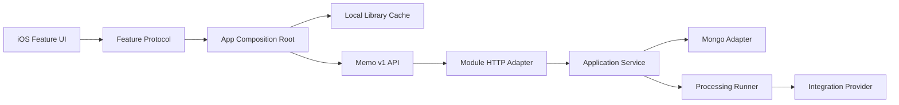

# Memo 架构总览

## 目标

本次重组只改变代码组织、依赖方向和数据同步接缝，不重做 UIKit 视觉、不切换技术栈，也不恢复二期 AI 问答能力。

## 仓库结构

```text
Knowledge/
├── contracts/                     # 前后端共享的 API 单一事实源
│   ├── openapi/memo-v1.yaml
│   └── fixtures/v1/
├── ios/KnowledgeIOS/
│   ├── KnowledgeIOS/
│   │   ├── App/                   # 生命周期、导航、依赖装配
│   │   ├── Features/              # Auth/Capture/Library/Search/...
│   │   ├── Shared/                # DesignSystem 与跨 Feature 工具
│   │   └── Resources/
│   ├── KnowledgeIOSTests/
│   └── KnowledgeIOSUITests/
├── backend/
│   ├── src/
│   │   ├── bootstrap/             # HTTP/Worker 组合根与进程入口
│   │   ├── modules/               # 业务模块
│   │   ├── integrations/          # 外部媒体、模型、ASR 适配器
│   │   └── platform/              # HTTP、数据库、安全、日志、配置
│   └── tests/
└── docs/architecture/
```

## 运行链路



## 组件职责

| 区域 | 可以做 | 不可以做 |
|---|---|---|
| `App` / `bootstrap` | 生命周期、导航、实例化、注入 | 业务规则、Provider 细节 |
| Feature / module | 用例、状态、领域模型、接口适配 | 直接装配全局依赖 |
| `Shared` / `platform` | 可复用技术能力 | 特定 Feature 业务流程 |
| `integrations` | 外部服务协议适配 | HTTP 路由和产品状态 |
| `contracts` | API 字段、状态、错误、示例 | 运行时代码 |

## 验证基线

- 后端：TypeScript 类型检查、Vitest、生产构建。
- iOS：Swift 6 Debug Simulator 构建、架构单测、完整 UIKit UI 测试。
- 契约：Fixture JSON 解析与 OpenAPI 路径存在性测试。

更细的边界见 [iOS 架构](ios.md)、[后端架构](backend.md)、[数据归属](data-ownership.md) 和 [依赖规则](dependency-rules.md)。
