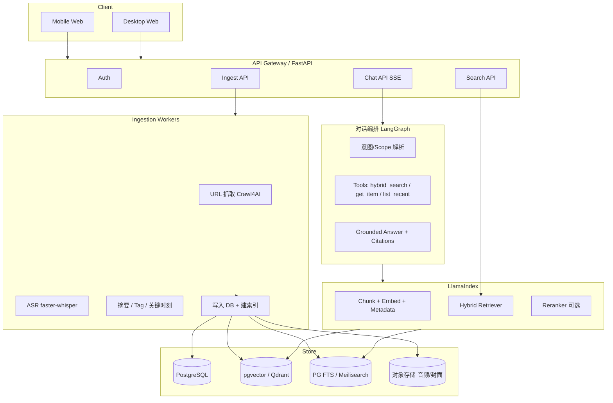

# Memo 技术选型方案：Agent + 知识库检索

> 基于仓库现状：当前仅有高保真 UI 原型（`prototype-v2/`），无后端 / RAG / Agent 实现。产品形态是「个人内容收藏 + AI 消化 / 检索 / 带引用问答」，不是通用 multi-agent 平台。

---

## 1. 产品本质（选型前提）

一句话：**个人知识收藏的 grounded RAG 助手 + 内容处理流水线**，不是复杂 tool-calling Agent 平台。

| 用户旅程 | 技术能力 |
|---------|---------|
| 粘贴 URL / 上传音频 | 抓取 / ASR / 类型识别 |
| 处理中：抓取 → 识别 → 摘要 → 入库 | 异步 Ingestion Pipeline |
| 文章 / 播客详情 | 摘要、关键引文、时间戳转写 |
| 搜索 | **全文 + 语义** 双轨 |
| AI 对话 | Scope（全部 / 本周 / 单条）+ **可点击引用** |
| Tag | AI 推荐 + 用户编辑 → 过滤增强 |

**选型原则：**

1. 优先保证 **引用可追溯的 RAG** 与 **混合检索**
2. Agent 只做轻量编排（检索、取原文、scope 过滤），不要一上来 multi-agent
3. 前端 UI 已定（editorial 风格），不宜整包采用 Dify / RAGFlow 自带界面当产品壳
4. 中文内容源（公众号 / 小宇宙 / B 站）需自建适配层，任何框架都不会开箱解决

---

## 2. 开源框架对比（按 Memo 场景）

### 2.1 两类选择

| 类型 | 代表 | 适合 Memo？ |
|------|------|------------|
| **应用平台**（带 UI） | Dify、RAGFlow、FastGPT、MaxKB、AnythingLLM | 适合验证 / 内部试用，不适合当最终产品壳 |
| **开发框架**（库） | LlamaIndex、Haystack、LangChain + LangGraph | **更适合 Memo**：自建 API + 现有原型前端 |

### 2.2 核心候选评估

| 框架 | 角色 | 优势 | 与 Memo 的契合度 | 建议 |
|------|------|------|-----------------|------|
| **LlamaIndex** | RAG 索引 / 检索 / Query Engine | 文档索引、混合检索、citation、scope filter 成熟 | ★★★★★ | **主推：RAG 核心** |
| **Haystack** | 生产级 Pipeline | 组件清晰、易测、Pipeline 可审计 | ★★★★☆ | 备选（偏工程严谨） |
| **LangGraph** | 轻量 Agent 编排 | 多轮、工具调用、状态机清晰 | ★★★★☆ | **主推：对话编排层** |
| **LangChain** | 胶水 / 生态 | 集成广 | ★★★☆☆ | 作适配层即可，别当架构中心 |
| **Dify** | 低代码 LLM 应用 | 上线快、内置 RAG/Agent | ★★☆☆☆ | 仅 MVP 验证，后期难贴合定制 UX |
| **RAGFlow** | 文档深度解析 + 引用 | PDF/表格强、citation 好 | ★★☆☆☆ | 文档企业库强；Memo 主战场是网页/播客 |
| **FastGPT / MaxKB** | 国内知识库问答 | 中文友好、部署简单 | ★★☆☆☆ | 同上，作参考或临时后端 |
| **Ragas / DeepEval** | 检索与生成评测 | 防止「看起来能聊、实际胡说」 | ★★★★★ | **必上（Phase 2）** |

### 2.3 结论（推荐组合）

```
产品前端（自研）
    ↓
API 层（FastAPI）
    ↓
对话编排：LangGraph（轻 Agent）
    ↓
检索与索引：LlamaIndex
    ↓
存储：PostgreSQL + pgvector（或 Qdrant）+ 全文（PG FTS / Meilisearch）
    ↓
摄入流水线：自研 Workers + Crawl4AI + faster-whisper
```

**为什么不是「只用 Dify」？**  
原型已锁定交互（scope、来源卡、播客时间轴、editorial UI）。用平台会变成「改别人的产品」；用框架是「做自己的 Memo」。

**为什么 LlamaIndex + LangGraph，而不是纯 LangChain？**  

- LlamaIndex 更擅长「私有数据索引与检索质量」
- LangGraph 更擅长「多轮对话状态 + 少量工具」
- 二者分工清晰，比「全家桶 LangChain」更贴 Memo

---

## 3. 推荐总体架构



---

## 4. 分层技术选型（建议默认值）

### 4.1 应用与 API

| 组件 | 推荐 | 说明 |
|------|------|------|
| 后端 | **Python 3.12 + FastAPI** | RAG 生态最强，和 LlamaIndex / Whisper 同栈 |
| 前端 | 原型 → **Next.js / React**（后期） | 先对齐 `prototype-v2`，再工程化 |
| 实时对话 | **SSE / Streaming** | 对齐 AI 打字体验 |
| 任务队列 | **Celery / ARQ + Redis** | 抓取 / ASR 耗时长，必须异步 |
| API 契约 | OpenAPI + Pydantic | 前后端并行开发 |

### 4.2 知识库与检索（核心）

| 组件 | 推荐 | 备选 | 说明 |
|------|------|------|------|
| RAG 框架 | **LlamaIndex** | Haystack 2.x | 索引、过滤、citation 模板 |
| 向量库 | **pgvector**（与业务同库） | **Qdrant** | 个人/小团队先 pgvector；规模上来换 Qdrant |
| 全文检索 | **PostgreSQL FTS** 或 **Meilisearch** | OpenSearch | 必须支持标题 / 正文 / Tag 命中 |
| 混合检索 | 向量 + BM25/FTS + **RRF 融合** | — | 对齐原型「全文 + 语义双轨」 |
| Rerank | **bge-reranker** / Cohere Rerank | FlashRank | Phase 2 再上，性价比高 |
| Embedding | `text-embedding-3-large` 或 **bge-m3**（中英） | — | 中文收藏库优先考虑 bge-m3 |
| Chunking | 按段落 + 元数据（item_id, type, tags, time） | Parent-Child | 播客按「关键时刻 / 时间窗」切 |

**检索 Scope（必须一等公民）：**

```text
metadata filters:
  - scope=all
  - scope=this_week  → created_at >= now-7d
  - scope=item       → item_id = current
  - type in [article, podcast]
  - tags overlap [...]
```

### 4.3 对话 /「轻 Agent」

| 组件 | 推荐 | 说明 |
|------|------|------|
| 编排 | **LangGraph** | 状态：messages / scope / citations |
| 工具集（够用即可） | `hybrid_search`、`get_item`、`get_transcript_segment` | 不要先做 20 个 tool |
| 回答约束 | 仅基于检索结果；无证据则拒答 | 对齐文案：「只基于你的收藏」 |
| 引用格式 | 行内 `[1]` + 来源卡（title + quote + item_id） | 前端可跳转详情 |
| LLM 网关 | **LiteLLM** | 统一 OpenAI / Anthropic / 本地模型 |

**建议的最小 Agent 图：**

```text
User Question
  → ParseScope
  → Retrieve (hybrid + filters)
  → (可选) Rerank
  → GenerateAnswerWithCitations
  → PersistTurn
```

这不是 ReAct 无限循环 Agent，而是 **可控的 grounded QA 流水线**——正好匹配 Memo。

### 4.4 内容摄入 Pipeline（差异化能力）

| 步骤 | 开源方案 | 备注 |
|------|---------|------|
| 网页抓取 | **Crawl4AI** / Firecrawl（开源版） / trafilatura | 公众号等需站点适配器 |
| YouTube / B 站 | yt-dlp + 字幕优先，无字幕再 ASR | |
| 播客音频 | yt-dlp / 直链下载 | |
| ASR | **faster-whisper**（large-v3） | 输出带时间戳 |
| 摘要 / Tag / 关键时刻 | LLM Structured Output（Pydantic） | 可用 LlamaIndex 的 transform |
| 不支持源 | 明确失败码 + 手抄正文 fallback | 对齐 `10-unsupported` |

**Pipeline 阶段（对齐原型）：**

1. `fetch` — 下载原始内容
2. `extract` — 正文 / 转写
3. `enrich` — 摘要、关键观点、Tag、播客关键时刻
4. `index` — chunk → embed → FTS → 可检索

### 4.5 数据模型（最小集）

```text
users
items              # 收藏条目：type, source_url, title, status...
item_contents      # 正文 / 转写全文
item_segments      # 播客时间片 / 文章段落（可检索单元）
tags / item_tags
embeddings         # segment_id + vector + metadata
conversations
messages           # role, content, citations[]
ingest_jobs        # 异步任务状态
```

---

## 5. 与原型能力的一一映射

| 原型能力 | 技术方案落点 |
|---------|-------------|
| 粘贴 URL 入库 | Ingest API + Crawl4AI + 站点 Adapter |
| 处理中 4 步进度 | `ingest_jobs` 状态机 + SSE/轮询 |
| 文章摘要 / 引文 | enrich 阶段 LLM + 存 `highlights` |
| 播客关键时刻 + 转写跳转 | faster-whisper timestamps + segments |
| 全文 + 语义搜索 | Meilisearch/PG FTS + pgvector + RRF |
| 搜索结果 AI 总结 | 对 Top-K 结果再做一次 summarize chain |
| AI 对话 + 来源卡 | LangGraph + LlamaIndex retriever + citation schema |
| Scope：全部 / 本周 / 单条 | metadata filter |
| 对话存为新收藏 | `messages` → 生成 `item(type=note)` |
| Tag 认知地图 | enrich 推荐 + 用户编辑写回，并进入 filter |

---

## 6. 不推荐 / 慎用的路线

| 路线 | 原因 |
|------|------|
| 一上来 AutoGPT 式 multi-agent | 产品不需要；成本高、难控幻觉 |
| 直接用 Dify/RAGFlow 当产品前端 | UI/交互无法对齐 Memo 品牌与原型 |
| 只用向量检索、不做全文 | 专有名词、标题、Tag 命中会差 |
| 同步处理 ASR/抓取 | 体验卡死；必须异步 Job |
| 忽略评测 | 收藏库一变大，检索质量会 silently 退化 |

---

## 7. 分阶段落地路线

### Phase 0 — 验证（1–2 周）

- LlamaIndex + pgvector + 假数据 / 少量真实网页
- 跑通：入库 → 混合检索 → 带引用问答
- 可选：用 Dify 做对照基线，但不绑死

### Phase 1 — MVP（对齐原型主路径）

- FastAPI + 异步 Ingestion（网页文章优先）
- 搜索双轨 + AI Chat（scope + citations）
- 前端先接 Web 三屏（home / add / ai）

### Phase 2 — 播客与质量

- faster-whisper、关键时刻、转写跳转
- Rerank、Ragas 评测集、引用点击率埋点
- 公众号 / 小宇宙等 Adapter

### Phase 3 — 产品化

- 账号 / 同步 / 「本地优先」策略（若要坚持隐私）
- LiteLLM 多模型、成本与限流
- 对话另存为收藏、插入引用等 Web 能力

---

## 8. 推荐默认技术栈清单

```text
Language:        Python 3.12
API:             FastAPI + SSE
Orchestration:   LangGraph
RAG:             LlamaIndex
LLM Gateway:     LiteLLM
Embedding:       bge-m3 或 text-embedding-3-large
Vector:          pgvector（同库）→ 后期可迁 Qdrant
Full-text:       PostgreSQL FTS 或 Meilisearch
Queue:           Redis + ARQ/Celery
Crawl:           Crawl4AI + 站点 Adapter
ASR:             faster-whisper
Object Storage:  S3 兼容（MinIO 本地）
Eval:            Ragas
Frontend:        现有 prototype → Next.js
```

**一句话选型：**  
用 **LlamaIndex 做知识检索质量**，用 **LangGraph 做轻量对话 Agent**，用 **自研 Ingestion 做中文内容源差异化**，用 **自研前端承接 Memo 品牌 UX**；Dify/RAGFlow 只作加速验证，不作最终产品底座。
