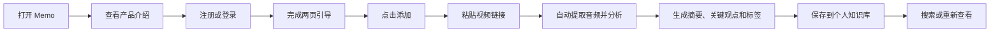

# Memo 最小化上线 PRD

## 1. 一句话说明

Memo 是一个避免视频“收藏吃灰”的个人知识库：把值得看的视频链接发进来，自动提取音频、总结重点并长期保存。

## 2. 要解决的问题

用户在 B 站、小红书、抖音等平台收藏了很多有价值的视频，但通常不会再打开，最后变成分散在不同平台里的“收藏夹库存”。

Memo 不再强调“AI 功能”，而是直接解决三个问题：

1. 收藏以后没有时间看；
2. 看过以后记不住重点；
3. 想再找时，不知道收藏在哪个平台。

用户最终得到的不是另一个视频收藏夹，而是一个可以持续积累、搜索和回看的个人知识库。

## 3. 一期预期结果

一期只完成一条闭环：



核心判断：用户不需要先理解 AI，也不需要学习复杂操作，只需要知道“把链接发进来，Memo 会帮我把它变成知识”。

## 4. 首次使用流程

### 4.1 产品介绍页：注册或登录之前

**页面目标**：让用户在进入账号流程前，先知道 Memo 是什么、能为自己留下什么。

**主标题**：

> 把收藏的视频，变成真正用得上的知识

**说明文案**：

> 把值得留下的视频链接交给 Memo，重点会被整理并长期保存，方便以后搜索、回看和使用。

**底部操作**：

- 只保留一个主按钮：`开始使用`

点击后默认进入登录页；尚未注册的用户，再通过登录页中的文字入口 `创建账号` 进入注册流程。产品介绍页不同时摆放“创建账号”和“登录”两个同等级按钮。

### 4.2 引导页 1：解决什么问题

**页面目标**：只讲用户当前的困境，不在这一页解释处理流程。

**问题提示**：

> 别再让收藏夹吃灰

**主标题**：

> 收藏了，不等于真正看过

**说明文案**：

> 值得看的视频散落在不同平台。收藏得越来越多，真正看完、记住和再次找到的却越来越少。

**画面建议**：

- 参考 flomo 的做法，一页只讲一个价值点；
- 展示不断堆积、逐渐被遗忘的视频收藏；
- 不展示 AI 对话、模型、技术名词或复杂功能列表。

**底部操作**：

- 进度：`1 / 2`
- 主按钮：`下一步`
- 可保留右上角：`跳过`

### 4.3 引导页 2：怎么使用

**页面目标**：用一句话讲清楚操作方法和最终结果。

**主标题**：

> 粘贴链接，剩下的交给 Memo

**说明文案**：

> 复制 B 站、小红书或抖音的视频链接，Memo 会整理出摘要、关键观点和标签，保存进你的知识库。

**画面建议**：

- 用三段式过程表达：`粘贴链接 → 整理重点 → 保存知识卡片`；
- 只展示一个代表性链接和一张生成后的知识卡片；
- 保持大标题、短说明、大留白和单一主按钮。

**底部操作**：

- 进度：`2 / 2`
- 主按钮：`开始使用`

点击后直接进入收藏首页，不再重复展示其他新手引导。

## 5. 首页

首页参考 flomo 的信息流感，但内容对象是“已经处理过的视频知识”。

只保留三个核心入口：

1. **收藏列表**：按照最近添加排序；
2. **搜索**：搜索标题、摘要、关键观点和标签；
3. **添加按钮**：固定在底部，作为全局最明显的操作。

每条收藏最少展示：

- 来源平台；
- 视频标题；
- 一句话摘要；
- 标签；
- 添加时间；
- 处理状态。

首页不展示：

- AI 问答入口；
- AI 洞察、每日回顾、随机漫步；
- 推荐流、社区、关注关系；
- 复杂的知识图谱或文件夹体系。

空状态文案：

> 把第一条值得留下的视频，变成你的知识。

空状态按钮：

> 添加第 1 条

## 6. 添加与处理

### 6.1 添加

用户点击底部添加按钮后：

1. 粘贴视频链接；
2. Memo 自动识别来源；
3. 用户点击 `开始解析`；
4. 立即返回收藏首页，并出现一条“处理中”的内容。

一期主推来源：

- B 站；
- 小红书；
- 抖音。

当前后端已经可以识别 YouTube，可作为兼容来源保留，但不需要在首屏重点宣传。

一期只要求用户在 App 内粘贴链接。系统分享菜单、批量导入和文件上传不作为首发必须项。

### 6.2 处理状态

| 状态 | 用户看到的文案 | 用户可以做什么 |
|---|---|---|
| 等待处理 | 已收藏，等待解析 | 离开页面 |
| 处理中 | 正在提取音频 / 正在生成摘要 | 查看进度或继续使用 App |
| 已完成 | 已生成知识卡片 | 打开查看结果 |
| 失败 | 解析失败 | 重试或删除 |

## 7. 详情页

一条视频处理完成后，详情页按以下顺序展示：

1. 视频标题与来源；
2. 一句话摘要；
3. 为什么值得看；
4. 关键观点；
5. 章节与时间点；
6. 可执行事项；
7. 自动标签；
8. 原始转录文本。

详情页可以编辑标签、删除收藏和打开原视频，但不提供“基于这篇问 AI”。

## 8. 一期范围

### 必须上线

- 两页首次引导；
- 注册与登录；
- 首页收藏列表和空状态；
- 粘贴视频链接；
- B 站、小红书、抖音链接识别；
- 处理进度与失败重试；
- 自动生成摘要、关键观点、章节和标签；
- 详情查看；
- 搜索和删除。

### 明确不上线

- AI 对话和知识库问答；
- 每日回顾、随机漫步和 AI 洞察；
- Skill、CLI、MCP、Plugin；
- Agent 平台接入；
- 系统分享扩展；
- 批量导入；
- 社区和内容推荐。

## 9. 二期方向

二期再把 Memo 从“一个 App”扩展为“可被 Agent 使用的个人知识能力”：

```text
Memo 知识库
  ├─ Skill：让 Agent 理解如何添加、搜索和引用个人内容
  ├─ CLI：允许本地脚本和自动化流程调用
  └─ 主流 Agent 平台：通过统一接口读取和使用知识
```

二期的核心是复用一期已经沉淀的结构化内容，不改变一期“先把视频变成知识”的主流程。

## 10. 验收标准

- 首次启动只展示 2 页引导，第一页明确出现“收藏夹吃灰”；
- 第二页能让未接触过产品的用户复述出“粘贴链接即可自动总结”；
- 完成引导和登录后直接进入收藏首页；
- App 内所有主导航和详情页均不出现 AI 问答入口；
- 用户可以提交 B 站、小红书或抖音视频链接；
- 提交后 2 秒内在首页看到对应的处理中条目；
- 处理成功后可以查看摘要、关键观点、章节和标签；
- 处理失败时保留原收藏，并提供明确的失败原因和重试入口；
- 用户可以搜索、打开和删除已完成的知识条目。

## 11. 现有项目改动重点

1. 将当前 3 步引导改为本 PRD 的 2 步文案和画面；
2. 删除引导中的“收藏越多，问得越准”及所有知识问答表达；
3. 首页继续保持 `收藏 + 添加`，不恢复 AI Tab；
4. 添加页文案从“任意内容收藏”收束为“视频链接转知识”；
5. 详情页移除“基于这篇问 AI”；
6. 同步更新 App Store 宣传文案、产品描述和审核路径。

## 12. 产品命名候选

命名原则：

- 不在产品名里强调 AI；
- 能让人联想到“把看过的内容留下来”；
- 不把产品限制成单纯的视频下载或摘要工具；
- 二期扩展到 Skill、CLI 和 Agent 平台后仍然适用。

| 名称 | 一句话感觉 | 可搭配的宣传语 | 判断 |
|---|---|---|---|
| **拾见** | 拾起看过内容里的见解 | 把值得看的，变成记得住的 | **首选，简短、有内容感，也适合以后扩展** |
| **知藏** | 把收藏真正沉淀成知识 | 收藏不吃灰，知识留得住 | 产品价值最直接，但气质稍偏工具 |
| **见知** | 从“看见”走到“知道” | 每一次看见，都能留下知识 | 有品牌感，但需要副标题解释产品用途 |
| **留知** | 留下值得长期保存的内容 | 让有价值的内容留下来 | 温和、好理解，但辨识度相对普通 |
| **回响** | 让收藏过的内容持续产生价值 | 让看过的内容，再次回应你 | 情绪感最好，但不能直接说明知识管理 |
| **Memo** | 简洁、国际化的个人记忆工具 | Turn saved videos into knowledge | 可以继续沿用现有名称，但中文用户难以仅凭名称理解用途 |
| **Mindrop** | 把链接丢进自己的知识空间 | Drop a link. Keep the knowledge. | 适合海外版本，但需要确认读音和商标可用性 |
| **LinkMemo** | 链接进入，知识留下 | One link, one lasting note. | 功能理解成本最低，但品牌感相对弱 |

当前推荐顺序：

1. **拾见**：最适合作为中文主品牌；
2. **知藏**：最容易直接说清产品价值；
3. **Memo**：如果更重视延续现有工程和海外品牌，可以暂时保留。

以上是产品方向候选，尚未核验 App Store 重名、商标和域名可用性。最终定名前需要单独完成一次名称检索。
