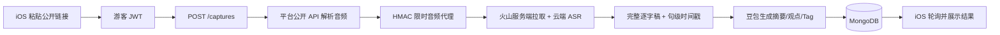

# Memo 最小化上线技术方案（已落地版）

> 第一版只验证一件事：用户粘贴一个公开视频链接，稍后拿到真实逐字稿和总结。

## 结论

当前最小上线使用：

| 模块 | 选择 |
|---|---|
| 客户端 | 现有 iOS；鸿蒙后续复用同一 HTTP API |
| API / 任务 | Node.js + TypeScript + Express，单进程串行队列 |
| 数据库 | MongoDB，与 API 部署在同一台云服务器 |
| 平台解析 | B站公开 player API；其他平台 yt-dlp / 抖音解析器 |
| 默认转写 | 火山 `volc.bigasr.auc` 云端长音频 ASR |
| 总结 | Doubao-Seed-2.0-mini，长稿 Map-Reduce 后输出结构化 JSON |
| 身份 | 自动游客账号，不强制注册登录 |
| 部署 | 一台 4 核 8 GB CPU 云服务器即可起步 |

第一版不引入 Redis、BullMQ、Kubernetes、GPU、向量数据库、RAG、微服务或
平台 Cookie 池。生产链路不运行本地 Whisper。

## 已实现的真实链路



真实端到端测试使用 4 小时 37 分 52 秒 B站公开视频，最终得到：

- B站公开接口成功解析最低码率 DASH 音频；
- 火山标准录音文件识别完成 75,673 字逐字稿、3,102 个句级时间段；
- 逐字稿最后时间点为 16,666.73 秒，距视频结束约 5.27 秒；
- 5 个长文本分段全部提炼成功，最终生成 1 条摘要、6 条关键观点、7 个章节；
- 转录 Provider：`volcengine-bigasr`；
- 总结 Provider：`volcengine-ark-responses`；
- 总结主模型：`doubao-seed-2-0-mini-260428`；额度耗尽、服务暂停或未开通时可按
  `ARK_SUMMARY_FALLBACK_MODELS` 自动切换备用模型。

## 为什么第一版仍保留 MongoDB

现有数据模型已经覆盖：

- 游客或注册用户；
- 处理任务、状态、错误和日志；
- 原始链接、逐字稿、总结和 Tag；
- 幂等提交、历史列表和软删除；
- 服务重启后的未完成任务恢复。

现在换 PostgreSQL 不会改善用户体验，只会增加迁移工作。等需要复杂报表、付费订单或多表事务时再评估 PostgreSQL。

## 登录策略

用户不需要先登录。

```text
App 首次启动
→ 生成并持久化 installationId
→ POST /auth/guest
→ 后端创建或复用 guest user
→ JWT 保存到 Keychain
→ 用户直接粘贴链接
```

游客 JWT 仍然用于任务归属、限流和数据隔离。以后需要换机同步或付费时，再提供游客账号绑定手机号/邮箱。

Memo 登录和视频平台登录是两件事。B站公开链接不需要用户登录；私密内容和必须
登录的内容返回明确错误。小红书、抖音若需要平台登录，只能由后端挂载受控 Cookie
密钥，不能读取用户或开发者电脑上的 Chrome。

## 云端 ASR 主链路

生产默认 `volc_asr` Provider，支持：

- 旧控制台 APP ID + Access Token 鉴权；
- `volc.bigasr.auc` submit / query；
- 任务轮询；
- 逐字稿和句级时间戳映射；
- 未授权资源和超时的明确错误；
- 网络、限流和服务繁忙自动重试；
- 服务重启后复用原 request ID 继续查询，不重复提交；
- 官方标准版最长 3 小时处理窗口。

生产环境启动时会强制校验 `VIDEO_PROCESSOR=volc_asr` 和
`COPYWRITER_PROVIDER=ark`，配置成本地 Whisper、Mock 或本地模拟总结会直接拒绝
启动，避免测试配置误上云。

长逐字稿不会一次性塞给总结模型：后端先按时间段切成约 18,000 字符的块，逐块
提炼忠实笔记，再汇总成固定 JSON。若主模型因免费额度耗尽、服务暂停或未开通而
失败，会自动切到配置的备用模型；网络抖动则在当前模型上重试。

B站不再经过 yt-dlp 网页提取器。后端先调用公开 `view` 和 `playurl` 接口，选择最低
码率 DASH 音频，再生成带 HMAC 和 4 小时过期时间的服务端代理 URL。火山从代理
拉取时，后端会重新解析最新 CDN 地址并透传 Range，不落盘。这条链路不需要 Chrome、
Cookie、本地 Whisper、TOS 或 GPU。YouTube、小红书、抖音如果出现火山无法拉取临时
CDN 的情况，再启用第二级兜底：服务器下载音频、上传 TOS、生成短期签名 URL，
任务结束删除对象。TOS 不是当前 B站上线的前置条件。

## 三个平台

| 平台 | 第一版策略 | 风险 |
|---|---|---|
| B站 | 公开 view/playurl API，最低码率 DASH 音频 | API 变化 |
| 抖音 | 公开分享链接，自有解析器 | 页面结构变化 |
| 小红书 | 公开链接，yt-dlp | 最容易要求登录 |

“监控三平台收藏夹”不属于最小上线，也不应在云服务器里登录用户账号。第一版是用户主动提交链接；后续若平台提供官方开放 API，再单独设计授权和定时同步。

## 云服务器部署

第一版一台服务器即可：

```text
Nginx / Caddy（HTTPS，配置 PUBLIC_BASE_URL）
├── Node API + 串行任务队列
└── MongoDB
```

建议：

- 2 核 4 GB CPU 可起步；不运行 ASR 模型，无需 GPU；
- 100 GB 磁盘起步；
- MongoDB 只监听内网；
- API Key 只放环境变量或云端 Secret Manager；
- 平台临时音频 URL 不落盘；未来 TOS 兜底对象在任务结束后删除；
- 每个游客设置每日次数和单条时长上限；
- 先保持任务并发为 1。

只有当真实任务开始排队，再拆出 Worker；只有当多实例抢任务，再引入 Redis/BullMQ。不要在获得用户反馈前提前扩展。

## 当前边界

- 本地音视频上传不是最小 App 的承诺范围；生产主流程只承诺公开链接。
- B站公开视频云 ASR 已不依赖对象存储；其他平台临时 CDN 被拒时仍需 TOS 兜底。
- App 当前默认 API 地址是本机 `127.0.0.1:3100`；发布前必须替换为正式 HTTPS 域名。
- 真实密钥不得提交 Git，且已经通过仓库密钥扫描。

## 上线顺序

1. 购买一台云服务器并配置域名、HTTPS。
2. 用 Docker Compose 或 systemd 启动 MongoDB 和 Node 后端。
3. 在服务器环境变量注入豆包语音 APP ID / Access Token 和方舟 Key。
4. 把 iOS / 鸿蒙的 API Base URL 改为正式 HTTPS 地址。
5. 用 B站、抖音、小红书各 5 条公开链接做验收。
6. 先邀请少量用户，观察成功率、处理时长和用户是否保存结果。
7. 只有出现平台 CDN 拉取失败，再增加 TOS 作为二级兜底。
