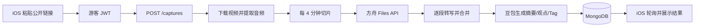

# Memo 最小化上线技术方案（已落地版）

> 第一版只验证一件事：用户粘贴一个公开视频链接，稍后拿到真实逐字稿和总结。

## 结论

当前最小上线使用：

| 模块 | 选择 |
|---|---|
| 客户端 | 现有 iOS；鸿蒙后续复用同一 HTTP API |
| API / 任务 | Node.js + TypeScript + Express，单进程串行队列 |
| 数据库 | MongoDB，与 API 部署在同一台云服务器 |
| 平台解析 | 复用 `videosummarize` 的 yt-dlp / 抖音解析器 |
| 音频 | FFmpeg 转 16kHz 单声道 48kbps MP3 |
| 默认转写 | Doubao-Seed-2.0-lite，长音频按 4 分钟切片上传 |
| 总结 | Doubao-Seed-2.0-lite，根据完整逐字稿输出结构化 JSON |
| 身份 | 自动游客账号，不强制注册登录 |
| 部署 | 一台 4 核 8 GB CPU 云服务器即可起步 |

第一版不引入 Redis、BullMQ、Kubernetes、GPU、向量数据库、RAG、微服务或平台 Cookie 池。

## 已实现的真实链路



真实端到端测试使用 13 分 47 秒 YouTube 视频，最终得到：

- 4 个音频切片全部成功转写；
- 4,408 字真实逐字稿；
- 真实一句话总结、7 条关键观点和 3 个 Tag；
- 转录 Provider：`volcengine-ark-audio-chunked`；
- 总结 Provider：`volcengine-ark-responses`；
- 总结模型：`doubao-seed-2-0-lite-260428`。

## 为什么第一版仍保留 MongoDB

现有数据模型已经覆盖：

- 游客或注册用户；
- 处理任务、状态、错误和日志；
- 原始链接、逐字稿、总结和 Tag；
- 幂等提交、历史列表和软删除；
- 服务重启后的未完成任务恢复。

现在换 PostgreSQL 不会改善用户体验，只会增加迁移工作。等需要复杂报表、付费订单或多表事务时再评估 PostgreSQL。

## 登录策略

用户不需要先登录。

```text
App 首次启动
→ 生成并持久化 installationId
→ POST /auth/guest
→ 后端创建或复用 guest user
→ JWT 保存到 Keychain
→ 用户直接粘贴链接
```

游客 JWT 仍然用于任务归属、限流和数据隔离。以后需要换机同步或付费时，再提供游客账号绑定手机号/邮箱。

Memo 登录和视频平台登录是两件事。第一版只支持无需平台登录即可访问的公开链接；私密内容和必须登录的内容返回明确错误，不保存用户的平台密码或 Cookie。

## 专用火山 ASR 的位置

代码已经实现 `volc_asr` Provider，支持：

- 旧控制台 APP ID + Access Token 鉴权；
- `volc.bigasr.auc` submit / query；
- 任务轮询；
- 逐字稿和句级时间戳映射；
- 未授权资源和超时的明确错误。

真实公网 WAV 测试成功返回 376 字、17 个时间段，说明凭证和接口可用。

但专用录音识别由火山服务端主动拉取音频 URL。YouTube 等平台的临时 CDN URL 可能校验请求头并拒绝第三方拉取；真实 YouTube 测试因此失败。正式切换专用 ASR 需要：

```text
服务器下载并压缩音频
→ 上传火山 TOS / S3 兼容对象存储
→ 生成短期签名 URL
→ 提交 volc_asr
→ 转写完成后删除对象
```

个人开发者第一版不必先加对象存储，所以默认使用已跑通的方舟分段上传方案。收到用户反馈、确认转写量后，再增加 TOS 并把 `VIDEO_PROCESSOR` 切成 `volc_asr`。

## 三个平台

| 平台 | 第一版策略 | 风险 |
|---|---|---|
| B站 | 公开链接，yt-dlp | 相对稳定 |
| 抖音 | 公开分享链接，自有解析器 | 页面结构变化 |
| 小红书 | 公开链接，yt-dlp | 最容易要求登录 |

“监控三平台收藏夹”不属于最小上线，也不应在云服务器里登录用户账号。第一版是用户主动提交链接；后续若平台提供官方开放 API，再单独设计授权和定时同步。

## 云服务器部署

第一版一台服务器即可：

```text
Nginx / Caddy（HTTPS）
├── Node API + 串行任务队列
└── MongoDB
```

建议：

- 4 核 8 GB CPU；
- 100 GB 磁盘起步；
- MongoDB 只监听内网；
- API Key 只放环境变量或云端 Secret Manager；
- 临时视频、音频和方舟文件在任务结束后删除；
- 每个游客设置每日次数和单条时长上限；
- 先保持任务并发为 1。

只有当真实任务开始排队，再拆出 Worker；只有当多实例抢任务，再引入 Redis/BullMQ。不要在获得用户反馈前提前扩展。

## 当前边界

- 本地音视频上传仍可用原有本地处理链路；最小 App 主流程只承诺公开链接。
- 通用方舟转写已通过分段解决长视频 JSON 截断问题，但没有句级时间戳，章节列表可能为空。
- 专用 ASR 能返回时间戳，但要先补对象存储。
- App 当前默认 API 地址是本机 `127.0.0.1:3100`；发布前必须替换为正式 HTTPS 域名。
- 真实密钥不得提交 Git，且已经通过仓库密钥扫描。

## 上线顺序

1. 购买一台云服务器并配置域名、HTTPS。
2. 用 Docker Compose 或 systemd 启动 MongoDB 和 Node 后端。
3. 在服务器环境变量注入方舟 Key。
4. 把 iOS / 鸿蒙的 API Base URL 改为正式 HTTPS 地址。
5. 用 B站、抖音、小红书各 5 条公开链接做验收。
6. 先邀请少量用户，观察成功率、处理时长和用户是否保存结果。
7. 用户量或成本验证后，再决定是否增加 TOS 并切换专用 ASR。
